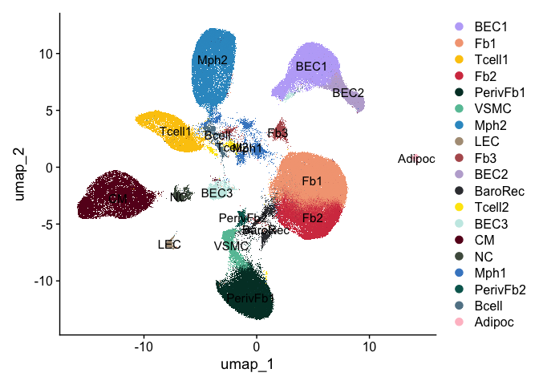
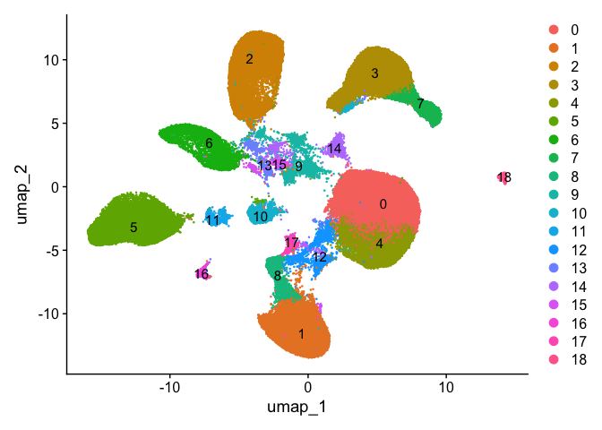
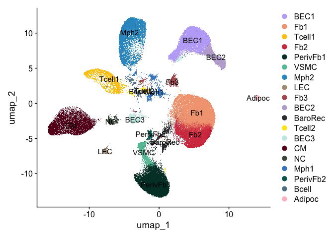
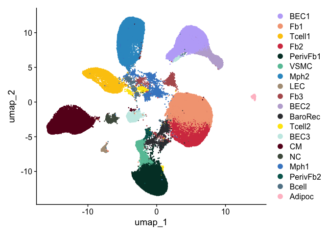
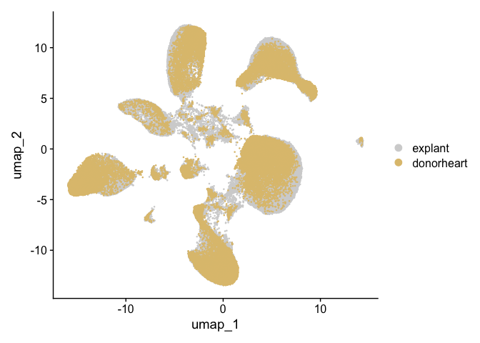
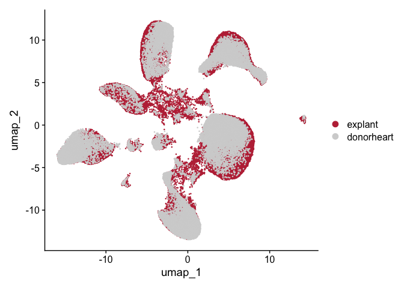
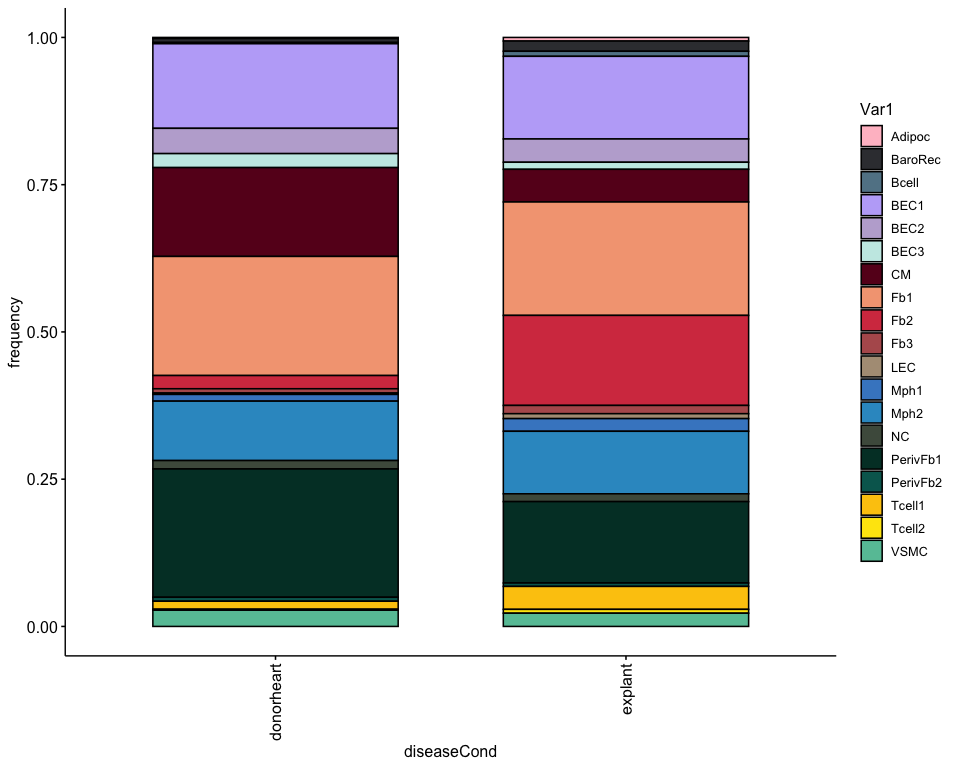
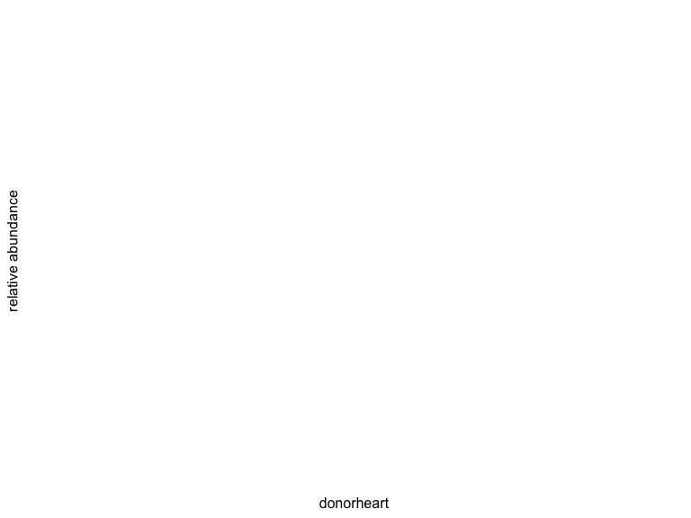
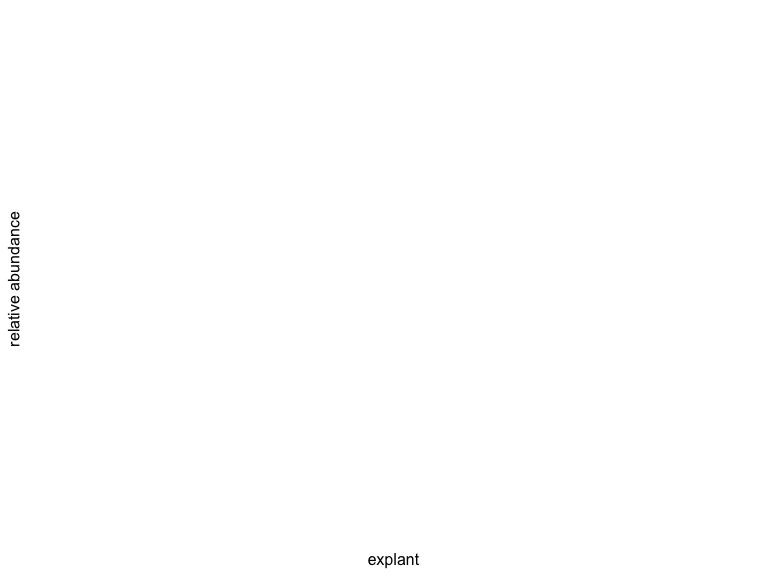

## load packages


## load object

``` r
fileNam <- "/Users/immbio/Desktop/HumanHeartCarTrans2/data/Human_heart_allmerged_seurat.rds"
seuratM <- readRDS(fileNam)
```

## Preperation

``` r
## patient
seuratM$patient <- "pat_nr"
seuratM$patient[grepl("HTx001|EMB001", seuratM$dataset)] <- "CarTransPat01"
seuratM$patient[grepl("HTx002|EMB002", seuratM$dataset)] <- "CarTransPat02"
seuratM$patient[grepl("HTx003|EMB003", seuratM$dataset)] <- "CarTransPat03"
seuratM$patient[grepl("HTx004|EMB004", seuratM$dataset)] <- "CarTransPat04"
seuratM$patient[grepl("HTx005|EMB005", seuratM$dataset)] <- "CarTransPat05"
seuratM$patient[grepl("HTx006|EMB006", seuratM$dataset)] <- "CarTransPat06"
seuratM$patient[grepl("HTx007|EMB007", seuratM$dataset)] <- "CarTransPat07"
seuratM$patient[grepl("HTx008|EMB008", seuratM$dataset)] <- "CarTransPat08"
seuratM$patient[grepl("HTx009|EMB009", seuratM$dataset)] <- "CarTransPat09"
seuratM$patient[grepl("HTx010|EMB010", seuratM$dataset)] <- "CarTransPat10"
seuratM$patient[grepl("HTx011|EMB011", seuratM$dataset)] <- "CarTransPat11"
seuratM$patient[grepl("HTx012|EMB012", seuratM$dataset)] <- "CarTransPat12"
seuratM$patient[grepl("HTx013|EMB013", seuratM$dataset)] <- "CarTransPat13"
seuratM$patient[grepl("HTx014|EMB014", seuratM$dataset)] <- "CarTransPat14"
seuratM$patient[grepl("HTx015|EMB015", seuratM$dataset)] <- "CarTransPat15"
seuratM$patient[grepl("HTx016|EMB016", seuratM$dataset)] <- "CarTransPat16"
seuratM$patient[grepl("HTx018|EMB018", seuratM$dataset)] <- "CarTransPat18"
seuratM$patient[grepl("HTx019|EMB019", seuratM$dataset)] <- "CarTransPat19"
seuratM$patient[grepl("HTx024|EMB024", seuratM$dataset)] <- "CarTransPat24"

seuratM$patient[which(seuratM$dataset == "o28576_1_08-8_20220525_Hu_nucseq_Graz_8_HH_GEM")] <- "HH01"
seuratM$patient[which(seuratM$dataset == "o28576_1_10-10_20220525_Hu_nucseq_Graz_10_HH_GEM")] <- "HH02"
seuratM$patient[which(seuratM$dataset == "o28576_1_11-11_20220525_Hu_nucseq_Graz_11_HH_GEM")] <- "HH03"
seuratM$patient[which(seuratM$dataset == "o28576_1_12-12_20220525_Hu_nucseq_Graz_12_HH_GEM")] <- "HH04"
seuratM$patient[which(seuratM$dataset =="o292731_1-1_20220818_Hu_nucseq_Graz_9_HH_GEM")] <- "HH05"
seuratM$patient[which(seuratM$dataset =="o292731_2-2_20220818_Hu_nucseq_Graz_13_HH_GEM")] <- "HH06"
seuratM$patient[which(seuratM$dataset == "o294781_01-1_20220912_Hu_nucseq_Graz_21_HH_GEM")] <- "HH07"
seuratM$patient[which(seuratM$dataset == "o294781_02-2_20220912_Hu_nucseq_Graz_22_HH_GEM")] <- "HH08"
seuratM$patient[which(seuratM$dataset == "o294781_03-3_20220912_Hu_nucseq_Graz_23_HH_GEM")] <- "HH09"
seuratM$patient[which(seuratM$dataset == "o294781_04-4_20220912_Hu_nucseq_Graz_24_HH_GEM")] <- "HH10"
table(seuratM$patient)
```

```
## 
## CarTransPat01 CarTransPat02 CarTransPat03 CarTransPat04 CarTransPat05 CarTransPat06 CarTransPat07 
##          7293         13731         10717         18991          8719          8915         11867 
## CarTransPat08 CarTransPat09 CarTransPat10 CarTransPat11 CarTransPat12 CarTransPat13 CarTransPat14 
##         10674         10542          7527          5161          8097          5663          7047 
## CarTransPat15 CarTransPat16 CarTransPat18 CarTransPat19          HH01          HH02          HH03 
##          4589         14887          2221          2493          4005          3922          4265 
##          HH04          HH05          HH06          HH07          HH08          HH09          HH10 
##          3853          6434         11568          1465          2064           866          2181
```

``` r
ordpatients <- c("HH01", "HH02", "HH03", "HH04", "HH05", "HH06", "HH07", "HH08", "HH09", "HH10", "CarTransPat01", "CarTransPat02", "CarTransPat03", "CarTransPat04", "CarTransPat05", "CarTransPat06", "CarTransPat07", "CarTransPat08", "CarTransPat09", "CarTransPat10", "CarTransPat11", "CarTransPat12", "CarTransPat13", "CarTransPat14", "CarTransPat15", "CarTransPat16", "CarTransPat18", "CarTransPat19", "CarTransPat24")

seuratM$clusterName <- "clusterName"
seuratM$clusterName[which(seuratM$RNA_snn_res.0.4 %in% "0" )] <- "Fb1"
seuratM$clusterName[which(seuratM$RNA_snn_res.0.4 %in% "1" )] <- "PerivFb1"
seuratM$clusterName[which(seuratM$RNA_snn_res.0.4 %in% "2" )] <- "Mph2"
seuratM$clusterName[which(seuratM$RNA_snn_res.0.4 %in% "3" )] <- "BEC1"
seuratM$clusterName[which(seuratM$RNA_snn_res.0.4 %in% "4" )] <- "Fb2"
seuratM$clusterName[which(seuratM$RNA_snn_res.0.4 %in% "5" )] <- "CM"
seuratM$clusterName[which(seuratM$RNA_snn_res.0.4 %in% "6" )] <- "Tcell1"
seuratM$clusterName[which(seuratM$RNA_snn_res.0.4 %in% "7" )] <- "BEC2"
seuratM$clusterName[which(seuratM$RNA_snn_res.0.4 %in% "8" )] <- "VSMC"
seuratM$clusterName[which(seuratM$RNA_snn_res.0.4 %in% "9" )] <- "Mph1"
seuratM$clusterName[which(seuratM$RNA_snn_res.0.4 %in% "10" )] <- "BEC3"
seuratM$clusterName[which(seuratM$RNA_snn_res.0.4 %in% "11" )] <- "NC"
seuratM$clusterName[which(seuratM$RNA_snn_res.0.4 %in% "12" )] <- "BaroRec"
seuratM$clusterName[which(seuratM$RNA_snn_res.0.4 %in% "13" )] <- "Bcell"
seuratM$clusterName[which(seuratM$RNA_snn_res.0.4 %in% "14" )] <- "Fb3"
seuratM$clusterName[which(seuratM$RNA_snn_res.0.4 %in% "15" )] <- "Tcell2"
seuratM$clusterName[which(seuratM$RNA_snn_res.0.4 %in% "16" )] <- "LEC"
seuratM$clusterName[which(seuratM$RNA_snn_res.0.4 %in% "17" )] <- "PerivFb2"
seuratM$clusterName[which(seuratM$RNA_snn_res.0.4 %in% "18" )] <- "Adipoc"

colclusterName <- c("#67001f", "#f4a582","#D53E4F", "#B45B5C","#003c30","#01665e","#66C2A5", "#BEAEF8","#BEAED4", "#c7eae5", "#B09C85", "#4e5a4c","#393A3F","pink","#4588CA","#3299CA","#FCC80B","#FEE60B","#628395")
names(colclusterName) <- c("CM","Fb1","Fb2","Fb3","PerivFb1","PerivFb2","VSMC","BEC1","BEC2","BEC3","LEC","NC","BaroRec","Adipoc","Mph1","Mph2","Tcell1","Tcell2","Bcell")


### diseaseCond
seuratM$diseaseCond <- "diseaseCond"
seuratM$diseaseCond[grepl("V1", seuratM$dataset)] <- "visit1"
seuratM$diseaseCond[grepl("V2|353921_12-12_20240515_Hu_nucseq_USZ_EMB010_V1_2", seuratM$dataset)] <- "visit2"
seuratM$diseaseCond[grepl("V3", seuratM$dataset)] <- "visit3"
seuratM$diseaseCond[grepl("V4", seuratM$dataset)] <- "visit4"
seuratM$diseaseCond[grepl("V5", seuratM$dataset)] <- "visit5"
seuratM$diseaseCond[grepl("VX1", seuratM$dataset)] <- "visitX1"
seuratM$diseaseCond[grepl("VX2", seuratM$dataset)] <- "visitX2"
seuratM$diseaseCond[grepl("VX3", seuratM$dataset)] <- "visitX3"
seuratM$diseaseCond[grepl("VX4", seuratM$dataset)] <- "visitX4"
seuratM$diseaseCond[grepl("HH", seuratM$dataset)] <- "donorheart"
seuratM$diseaseCond[grepl("RV|LV|expLV|expRV|331571_3-5_20231012_Hu_nucseq_USZ_HTx001|331571_4-6_20231012_Hu_nucseq_USZ_HTx002", seuratM$dataset)] <- "explant"
table(seuratM$diseaseCond)
```

```
## 
## donorheart    explant     visit1     visit2     visit3     visit4     visit5    visitX1    visitX2 
##      40623     107936      15328      14613       7921       5208        512       2423       2784 
##    visitX3    visitX4 
##       2007        402
```

``` r
orddiseaseCond <- c("donorheart","visit1", "visit2" ,"visit3", "visit4", "visit5", "visitX1", "visitX2", "visitX3", "visitX4", "explant")
Idents(seuratM) <- seuratM$diseaseCond
seuratM$diseaseCond <- factor(seuratM$diseaseCond, levels=orddiseaseCond)
table(seuratM$diseaseCond)
```

```
## 
## donorheart     visit1     visit2     visit3     visit4     visit5    visitX1    visitX2    visitX3 
##      40623      15328      14613       7921       5208        512       2423       2784       2007 
##    visitX4    explant 
##        402     107936
```

``` r
###combined slots
seuratM$patient_diseaseCond <- paste0(seuratM$patient, '_', seuratM$diseaseCond)
table(seuratM$patient_diseaseCond)
```

```
## 
## CarTransPat01_explant  CarTransPat01_visit1  CarTransPat01_visit2  CarTransPat01_visit3 
##                  5529                   509                  1184                    71 
## CarTransPat02_explant  CarTransPat02_visit1  CarTransPat02_visit2  CarTransPat02_visit3 
##                  7067                  1941                  2976                   368 
## CarTransPat02_visitX2 CarTransPat02_visitX3 CarTransPat03_explant  CarTransPat03_visit1 
##                   642                   737                  8137                  1987 
##  CarTransPat03_visit2  CarTransPat03_visit3 CarTransPat04_explant  CarTransPat04_visit1 
##                   418                   175                  9511                  1688 
##  CarTransPat04_visit2  CarTransPat04_visit3  CarTransPat04_visit4  CarTransPat04_visit5 
##                   638                   857                  4026                   294 
## CarTransPat04_visitX1 CarTransPat04_visitX2 CarTransPat04_visitX3 CarTransPat05_explant 
##                  1044                   453                   480                  4811 
##  CarTransPat05_visit1  CarTransPat05_visit2  CarTransPat05_visit3 CarTransPat06_explant 
##                  1132                   719                  2057                  6098 
##  CarTransPat06_visit1  CarTransPat06_visit2  CarTransPat06_visit3  CarTransPat06_visit4 
##                   493                   863                   258                   321 
##  CarTransPat06_visit5 CarTransPat06_visitX1 CarTransPat06_visitX2 CarTransPat06_visitX3 
##                   114                   340                   366                    62 
## CarTransPat07_explant  CarTransPat07_visit1  CarTransPat07_visit2  CarTransPat07_visit3 
##                  5381                  1524                  1838                   403 
##  CarTransPat07_visit4  CarTransPat07_visit5 CarTransPat07_visitX1 CarTransPat07_visitX2 
##                   431                   104                   432                  1166 
## CarTransPat07_visitX3 CarTransPat07_visitX4 CarTransPat08_explant  CarTransPat08_visit1 
##                   186                   402                  9231                    55 
##  CarTransPat08_visit2  CarTransPat08_visit3 CarTransPat08_visitX2 CarTransPat08_visitX3 
##                   589                   193                    64                   542 
## CarTransPat09_explant CarTransPat10_explant  CarTransPat10_visit1  CarTransPat10_visit2 
##                 10542                  5374                  1118                   292 
##  CarTransPat10_visit3 CarTransPat11_explant  CarTransPat11_visit1  CarTransPat11_visit2 
##                   743                  3387                   857                   245 
##  CarTransPat11_visit3 CarTransPat12_explant  CarTransPat12_visit1  CarTransPat12_visit2 
##                   672                  4531                   826                  2740 
## CarTransPat13_explant  CarTransPat13_visit1  CarTransPat13_visit2  CarTransPat13_visit3 
##                  4582                   541                   139                   401 
## CarTransPat14_explant  CarTransPat14_visit1  CarTransPat14_visit2  CarTransPat14_visit3 
##                  5144                  1106                   360                   437 
## CarTransPat15_explant  CarTransPat15_visit1  CarTransPat15_visit2  CarTransPat15_visit3 
##                  3718                   178                   216                   477 
## CarTransPat16_explant  CarTransPat16_visit1  CarTransPat16_visit2  CarTransPat16_visit3 
##                 13878                   607                   107                   295 
## CarTransPat18_explant  CarTransPat18_visit1  CarTransPat18_visit2  CarTransPat18_visit3 
##                  1015                    60                   382                    42 
##  CarTransPat18_visit4 CarTransPat18_visitX1 CarTransPat18_visitX2  CarTransPat19_visit1 
##                   430                   199                    93                   706 
##  CarTransPat19_visit2  CarTransPat19_visit3 CarTransPat19_visitX1       HH01_donorheart 
##                   907                   472                   408                  4005 
##       HH02_donorheart       HH03_donorheart       HH04_donorheart       HH05_donorheart 
##                  3922                  4265                  3853                  6434 
##       HH06_donorheart       HH07_donorheart       HH08_donorheart       HH09_donorheart 
##                 11568                  1465                  2064                   866 
##       HH10_donorheart 
##                  2181
```

``` r
seuratM$patient_clusterName <- paste0(seuratM$patient, '_', seuratM$clusterName)
table(seuratM$patient_clusterName)
```

```
## 
##   CarTransPat01_Adipoc  CarTransPat01_BaroRec    CarTransPat01_Bcell     CarTransPat01_BEC1 
##                    103                     58                     73                    833 
##     CarTransPat01_BEC2     CarTransPat01_BEC3       CarTransPat01_CM      CarTransPat01_Fb1 
##                    216                     30                    321                   2720 
##      CarTransPat01_Fb2      CarTransPat01_Fb3      CarTransPat01_LEC     CarTransPat01_Mph1 
##                    566                    107                     85                    118 
##     CarTransPat01_Mph2       CarTransPat01_NC CarTransPat01_PerivFb1 CarTransPat01_PerivFb2 
##                    908                     73                    552                     30 
##   CarTransPat01_Tcell1   CarTransPat01_Tcell2     CarTransPat01_VSMC   CarTransPat02_Adipoc 
##                    318                     46                    136                     44 
##  CarTransPat02_BaroRec    CarTransPat02_Bcell     CarTransPat02_BEC1     CarTransPat02_BEC2 
##                     93                    208                    854                    284 
##     CarTransPat02_BEC3       CarTransPat02_CM      CarTransPat02_Fb1      CarTransPat02_Fb2 
##                    361                   1382                   3717                    514 
##      CarTransPat02_Fb3      CarTransPat02_LEC     CarTransPat02_Mph1     CarTransPat02_Mph2 
##                    108                     96                    295                   1851 
##       CarTransPat02_NC CarTransPat02_PerivFb1 CarTransPat02_PerivFb2   CarTransPat02_Tcell1 
##                    221                   1357                     29                   1983 
##   CarTransPat02_Tcell2     CarTransPat02_VSMC   CarTransPat03_Adipoc  CarTransPat03_BaroRec 
##                    143                    191                      1                    418 
##    CarTransPat03_Bcell     CarTransPat03_BEC1     CarTransPat03_BEC2     CarTransPat03_BEC3 
##                    135                   2498                    539                    216 
##       CarTransPat03_CM      CarTransPat03_Fb1      CarTransPat03_Fb2      CarTransPat03_Fb3 
##                    436                   1354                   1413                    171 
##      CarTransPat03_LEC     CarTransPat03_Mph1     CarTransPat03_Mph2       CarTransPat03_NC 
##                     38                    149                   1218                    227 
## CarTransPat03_PerivFb1 CarTransPat03_PerivFb2   CarTransPat03_Tcell1   CarTransPat03_Tcell2 
##                    919                     68                    683                     62 
##     CarTransPat03_VSMC   CarTransPat04_Adipoc  CarTransPat04_BaroRec    CarTransPat04_Bcell 
##                    172                     29                    220                    431 
##     CarTransPat04_BEC1     CarTransPat04_BEC2     CarTransPat04_BEC3       CarTransPat04_CM 
##                   1669                    614                    268                   1623 
##      CarTransPat04_Fb1      CarTransPat04_Fb2      CarTransPat04_Fb3      CarTransPat04_LEC 
##                   2164                   2592                    194                    327 
##     CarTransPat04_Mph1     CarTransPat04_Mph2       CarTransPat04_NC CarTransPat04_PerivFb1 
##                    480                   3109                    127                   1698 
## CarTransPat04_PerivFb2   CarTransPat04_Tcell1   CarTransPat04_Tcell2     CarTransPat04_VSMC 
##                     58                   2864                    179                    345 
##   CarTransPat05_Adipoc  CarTransPat05_BaroRec    CarTransPat05_Bcell     CarTransPat05_BEC1 
##                     15                     43                    126                    821 
##     CarTransPat05_BEC2     CarTransPat05_BEC3       CarTransPat05_CM      CarTransPat05_Fb1 
##                    259                    151                    455                   2509 
##      CarTransPat05_Fb2      CarTransPat05_Fb3      CarTransPat05_LEC     CarTransPat05_Mph1 
##                    549                     57                     69                    151 
##     CarTransPat05_Mph2       CarTransPat05_NC CarTransPat05_PerivFb1 CarTransPat05_PerivFb2 
##                   1885                    129                    817                     18 
##   CarTransPat05_Tcell1   CarTransPat05_Tcell2     CarTransPat05_VSMC   CarTransPat06_Adipoc 
##                    491                     25                    149                    186 
##  CarTransPat06_BaroRec    CarTransPat06_Bcell     CarTransPat06_BEC1     CarTransPat06_BEC2 
##                    124                    140                    702                    180 
##     CarTransPat06_BEC3       CarTransPat06_CM      CarTransPat06_Fb1      CarTransPat06_Fb2 
##                    223                    514                   1640                   1639 
##      CarTransPat06_Fb3      CarTransPat06_LEC     CarTransPat06_Mph1     CarTransPat06_Mph2 
##                     60                    100                    129                   1148 
##       CarTransPat06_NC CarTransPat06_PerivFb1 CarTransPat06_PerivFb2   CarTransPat06_Tcell1 
##                     94                   1221                     28                    566 
##   CarTransPat06_Tcell2     CarTransPat06_VSMC   CarTransPat07_Adipoc  CarTransPat07_BaroRec 
##                     51                    170                     13                     60 
##    CarTransPat07_Bcell     CarTransPat07_BEC1     CarTransPat07_BEC2     CarTransPat07_BEC3 
##                    339                   1240                    374                    304 
##       CarTransPat07_CM      CarTransPat07_Fb1      CarTransPat07_Fb2      CarTransPat07_Fb3 
##                    559                   3079                    652                    133 
##      CarTransPat07_LEC     CarTransPat07_Mph1     CarTransPat07_Mph2       CarTransPat07_NC 
##                     30                    223                   1803                    196 
## CarTransPat07_PerivFb1 CarTransPat07_PerivFb2   CarTransPat07_Tcell1   CarTransPat07_Tcell2 
##                   1103                     50                   1429                     59 
##     CarTransPat07_VSMC   CarTransPat08_Adipoc  CarTransPat08_BaroRec    CarTransPat08_Bcell 
##                    221                     12                     90                     62 
##     CarTransPat08_BEC1     CarTransPat08_BEC2     CarTransPat08_BEC3       CarTransPat08_CM 
##                   2008                    579                    180                    458 
##      CarTransPat08_Fb1      CarTransPat08_Fb2      CarTransPat08_Fb3      CarTransPat08_LEC 
##                   1555                   2350                    196                     13 
##     CarTransPat08_Mph1     CarTransPat08_Mph2       CarTransPat08_NC CarTransPat08_PerivFb1 
##                    173                    989                    158                   1260 
## CarTransPat08_PerivFb2   CarTransPat08_Tcell1   CarTransPat08_Tcell2     CarTransPat08_VSMC 
##                     64                    198                     21                    308 
##   CarTransPat09_Adipoc  CarTransPat09_BaroRec    CarTransPat09_Bcell     CarTransPat09_BEC1 
##                      1                     93                     47                   1587 
##     CarTransPat09_BEC2     CarTransPat09_BEC3       CarTransPat09_CM      CarTransPat09_Fb1 
##                    484                     49                   1039                    638 
##      CarTransPat09_Fb2      CarTransPat09_Fb3      CarTransPat09_LEC     CarTransPat09_Mph1 
##                   1678                    101                      6                    272 
##     CarTransPat09_Mph2       CarTransPat09_NC CarTransPat09_PerivFb1 CarTransPat09_PerivFb2 
##                   1386                     36                   2251                     83 
##   CarTransPat09_Tcell1   CarTransPat09_Tcell2     CarTransPat09_VSMC   CarTransPat10_Adipoc 
##                    435                     72                    284                     17 
##  CarTransPat10_BaroRec    CarTransPat10_Bcell     CarTransPat10_BEC1     CarTransPat10_BEC2 
##                     79                     33                   1101                    349 
##     CarTransPat10_BEC3       CarTransPat10_CM      CarTransPat10_Fb1      CarTransPat10_Fb2 
##                     60                    762                   1367                    692 
##      CarTransPat10_Fb3      CarTransPat10_LEC     CarTransPat10_Mph1     CarTransPat10_Mph2 
##                    103                     15                     98                    546 
##       CarTransPat10_NC CarTransPat10_PerivFb1 CarTransPat10_PerivFb2   CarTransPat10_Tcell1 
##                    133                   1320                     47                    555 
##   CarTransPat10_Tcell2     CarTransPat10_VSMC   CarTransPat11_Adipoc  CarTransPat11_BaroRec 
##                     79                    171                     28                     61 
##    CarTransPat11_Bcell     CarTransPat11_BEC1     CarTransPat11_BEC2     CarTransPat11_BEC3 
##                     39                    466                    177                    186 
##       CarTransPat11_CM      CarTransPat11_Fb1      CarTransPat11_Fb2      CarTransPat11_Fb3 
##                    790                    986                    649                     46 
##      CarTransPat11_LEC     CarTransPat11_Mph1     CarTransPat11_Mph2       CarTransPat11_NC 
##                     47                     99                    716                     55 
## CarTransPat11_PerivFb1 CarTransPat11_PerivFb2   CarTransPat11_Tcell1   CarTransPat11_Tcell2 
##                    475                     10                    213                     23 
##     CarTransPat11_VSMC  CarTransPat12_BaroRec    CarTransPat12_Bcell     CarTransPat12_BEC1 
##                     95                     76                    189                   1688 
##     CarTransPat12_BEC2     CarTransPat12_BEC3       CarTransPat12_CM      CarTransPat12_Fb1 
##                    409                    126                    641                   1108 
##      CarTransPat12_Fb2      CarTransPat12_Fb3      CarTransPat12_LEC     CarTransPat12_Mph1 
##                   1095                    126                     10                    193 
##     CarTransPat12_Mph2       CarTransPat12_NC CarTransPat12_PerivFb1 CarTransPat12_PerivFb2 
##                    958                     79                    782                     49 
##   CarTransPat12_Tcell1   CarTransPat12_Tcell2     CarTransPat12_VSMC   CarTransPat13_Adipoc 
##                    343                     48                    177                     30 
##  CarTransPat13_BaroRec    CarTransPat13_Bcell     CarTransPat13_BEC1     CarTransPat13_BEC2 
##                     67                    113                   1178                    203 
##     CarTransPat13_BEC3       CarTransPat13_CM      CarTransPat13_Fb1      CarTransPat13_Fb2 
##                     95                    748                    327                    533 
##      CarTransPat13_Fb3      CarTransPat13_LEC     CarTransPat13_Mph1     CarTransPat13_Mph2 
##                    101                     20                    165                    737 
##       CarTransPat13_NC CarTransPat13_PerivFb1 CarTransPat13_PerivFb2   CarTransPat13_Tcell1 
##                     75                    671                     55                    331 
##   CarTransPat13_Tcell2     CarTransPat13_VSMC   CarTransPat14_Adipoc  CarTransPat14_BaroRec 
##                     34                    180                     85                     56 
##    CarTransPat14_Bcell     CarTransPat14_BEC1     CarTransPat14_BEC2     CarTransPat14_BEC3 
##                     51                    625                    211                    161 
##       CarTransPat14_CM      CarTransPat14_Fb1      CarTransPat14_Fb2      CarTransPat14_Fb3 
##                    269                   2112                   1145                     91 
##      CarTransPat14_LEC     CarTransPat14_Mph1     CarTransPat14_Mph2       CarTransPat14_NC 
##                     36                    153                    639                     74 
## CarTransPat14_PerivFb1 CarTransPat14_PerivFb2   CarTransPat14_Tcell1   CarTransPat14_Tcell2 
##                    826                     35                    333                     59 
##     CarTransPat14_VSMC   CarTransPat15_Adipoc  CarTransPat15_BaroRec    CarTransPat15_Bcell 
##                     86                     22                     76                     47 
##     CarTransPat15_BEC1     CarTransPat15_BEC2     CarTransPat15_BEC3       CarTransPat15_CM 
##                    237                     74                     98                    480 
##      CarTransPat15_Fb1      CarTransPat15_Fb2      CarTransPat15_Fb3      CarTransPat15_LEC 
##                   1643                    248                     18                     37 
##     CarTransPat15_Mph1     CarTransPat15_Mph2       CarTransPat15_NC CarTransPat15_PerivFb1 
##                    105                    709                     57                    497 
## CarTransPat15_PerivFb2   CarTransPat15_Tcell1   CarTransPat15_Tcell2     CarTransPat15_VSMC 
##                      6                    157                     26                     52 
##   CarTransPat16_Adipoc  CarTransPat16_BaroRec    CarTransPat16_Bcell     CarTransPat16_BEC1 
##                    116                    495                     80                   1157 
##     CarTransPat16_BEC2     CarTransPat16_BEC3       CarTransPat16_CM      CarTransPat16_Fb1 
##                    266                    286                    367                   4103 
##      CarTransPat16_Fb2      CarTransPat16_Fb3      CarTransPat16_LEC     CarTransPat16_Mph1 
##                   2314                    256                     44                    531 
##     CarTransPat16_Mph2       CarTransPat16_NC CarTransPat16_PerivFb1 CarTransPat16_PerivFb2 
##                   1541                    190                   2519                     91 
##   CarTransPat16_Tcell1   CarTransPat16_Tcell2     CarTransPat16_VSMC   CarTransPat18_Adipoc 
##                    226                    107                    198                     19 
##  CarTransPat18_BaroRec    CarTransPat18_Bcell     CarTransPat18_BEC1     CarTransPat18_BEC2 
##                     49                     81                    397                     96 
##     CarTransPat18_BEC3       CarTransPat18_CM      CarTransPat18_Fb1      CarTransPat18_Fb2 
##                     49                    132                    293                    124 
##      CarTransPat18_Fb3      CarTransPat18_LEC     CarTransPat18_Mph1     CarTransPat18_Mph2 
##                     11                     19                     17                    337 
##       CarTransPat18_NC CarTransPat18_PerivFb1 CarTransPat18_PerivFb2   CarTransPat18_Tcell1 
##                     43                    208                      4                    299 
##   CarTransPat18_Tcell2     CarTransPat18_VSMC   CarTransPat19_Adipoc  CarTransPat19_BaroRec 
##                      5                     38                      1                     19 
##    CarTransPat19_Bcell     CarTransPat19_BEC1     CarTransPat19_BEC2     CarTransPat19_BEC3 
##                     26                    193                     44                     78 
##       CarTransPat19_CM      CarTransPat19_Fb1      CarTransPat19_Fb2      CarTransPat19_Fb3 
##                    166                    273                     60                     20 
##      CarTransPat19_LEC     CarTransPat19_Mph1     CarTransPat19_Mph2       CarTransPat19_NC 
##                      3                     90                    554                     20 
## CarTransPat19_PerivFb1 CarTransPat19_PerivFb2   CarTransPat19_Tcell1   CarTransPat19_Tcell2 
##                    139                      1                    744                     47 
##     CarTransPat19_VSMC            HH01_Adipoc           HH01_BaroRec             HH01_Bcell 
##                     15                      4                     26                      7 
##              HH01_BEC1              HH01_BEC2              HH01_BEC3                HH01_CM 
##                    601                    191                     17                    726 
##               HH01_Fb1               HH01_Fb2               HH01_Fb3               HH01_LEC 
##                   1039                    106                     21                     13 
##              HH01_Mph1              HH01_Mph2                HH01_NC          HH01_PerivFb1 
##                     39                    328                     72                    571 
##          HH01_PerivFb2            HH01_Tcell1            HH01_Tcell2              HH01_VSMC 
##                     18                     62                      8                    156 
##            HH02_Adipoc           HH02_BaroRec             HH02_Bcell              HH02_BEC1 
##                     66                     18                      5                    316 
##              HH02_BEC2              HH02_BEC3                HH02_CM               HH02_Fb1 
##                     88                     24                   1125                   1009 
##               HH02_Fb2               HH02_Fb3               HH02_LEC              HH02_Mph1 
##                     13                     17                      8                     42 
##              HH02_Mph2                HH02_NC          HH02_PerivFb1          HH02_PerivFb2 
##                    448                     36                    526                     12 
##            HH02_Tcell1            HH02_Tcell2              HH02_VSMC           HH03_BaroRec 
##                     99                      6                     64                     27 
##             HH03_Bcell              HH03_BEC1              HH03_BEC2              HH03_BEC3 
##                     20                    570                    213                     30 
##                HH03_CM               HH03_Fb1               HH03_Fb2               HH03_Fb3 
##                    457                    516                    304                     29 
##               HH03_LEC              HH03_Mph1              HH03_Mph2                HH03_NC 
##                      1                     60                    625                     30 
##          HH03_PerivFb1          HH03_PerivFb2            HH03_Tcell1            HH03_Tcell2 
##                   1170                     30                     96                     13 
##              HH03_VSMC           HH04_BaroRec             HH04_Bcell              HH04_BEC1 
##                     74                     23                      5                    933 
##              HH04_BEC2              HH04_BEC3                HH04_CM               HH04_Fb1 
##                    227                     13                    118                   1070 
##               HH04_Fb2               HH04_Fb3               HH04_LEC              HH04_Mph1 
##                     38                     47                      6                     19 
##              HH04_Mph2                HH04_NC          HH04_PerivFb1          HH04_PerivFb2 
##                    202                     22                    974                     34 
##            HH04_Tcell1            HH04_Tcell2              HH04_VSMC            HH05_Adipoc 
##                     29                      2                     91                      4 
##           HH05_BaroRec             HH05_Bcell              HH05_BEC1              HH05_BEC2 
##                     42                     10                    612                    217 
##              HH05_BEC3                HH05_CM               HH05_Fb1               HH05_Fb2 
##                    613                    854                   1534                    184 
##               HH05_Fb3               HH05_LEC              HH05_Mph1              HH05_Mph2 
##                     20                     28                     67                    842 
##                HH05_NC          HH05_PerivFb1          HH05_PerivFb2            HH05_Tcell1 
##                     73                   1052                     15                    106 
##            HH05_Tcell2              HH05_VSMC            HH06_Adipoc           HH06_BaroRec 
##                      5                    156                      3                    112 
##             HH06_Bcell              HH06_BEC1              HH06_BEC2              HH06_BEC3 
##                     10                   1791                    591                    251 
##                HH06_CM               HH06_Fb1               HH06_Fb2               HH06_Fb3 
##                   2318                   2262                    176                    146 
##               HH06_LEC              HH06_Mph1              HH06_Mph2                HH06_NC 
##                     21                    175                    814                    268 
##          HH06_PerivFb1          HH06_PerivFb2            HH06_Tcell1            HH06_Tcell2 
##                   2053                    126                     77                     26 
##              HH06_VSMC           HH07_BaroRec             HH07_Bcell              HH07_BEC1 
##                    348                      5                     10                    206 
##              HH07_BEC2                HH07_CM               HH07_Fb1               HH07_Fb2 
##                     53                     78                     71                     17 
##               HH07_Fb3              HH07_Mph1              HH07_Mph2                HH07_NC 
##                      2                     15                    166                     15 
##          HH07_PerivFb1          HH07_PerivFb2            HH07_Tcell1            HH07_Tcell2 
##                    737                     11                      9                      7 
##              HH07_VSMC           HH08_BaroRec             HH08_Bcell              HH08_BEC1 
##                     63                      7                     11                    229 
##              HH08_BEC2              HH08_BEC3                HH08_CM               HH08_Fb1 
##                     40                      2                    221                    303 
##               HH08_Fb2               HH08_Fb3              HH08_Mph1              HH08_Mph2 
##                     18                      8                     26                    407 
##                HH08_NC          HH08_PerivFb1          HH08_PerivFb2            HH08_Tcell1 
##                     32                    663                      8                     27 
##            HH08_Tcell2              HH08_VSMC           HH09_BaroRec             HH09_Bcell 
##                      1                     61                      5                      4 
##              HH09_BEC1              HH09_BEC2              HH09_BEC3                HH09_CM 
##                    167                     51                      8                     62 
##               HH09_Fb1               HH09_Fb2               HH09_Fb3               HH09_LEC 
##                     42                     27                      3                      7 
##              HH09_Mph1              HH09_Mph2                HH09_NC          HH09_PerivFb1 
##                      9                    123                      8                    307 
##          HH09_PerivFb2            HH09_Tcell1            HH09_Tcell2              HH09_VSMC 
##                      8                      8                      1                     26 
##            HH10_Adipoc           HH10_BaroRec             HH10_Bcell              HH10_BEC1 
##                      1                      5                      6                    409 
##              HH10_BEC2              HH10_BEC3                HH10_CM               HH10_Fb1 
##                     72                      5                    170                    367 
##               HH10_Fb2               HH10_Fb3               HH10_LEC              HH10_Mph1 
##                     29                      3                     13                     10 
##              HH10_Mph2                HH10_NC          HH10_PerivFb1          HH10_PerivFb2 
##                    142                     23                    798                     11 
##            HH10_Tcell1            HH10_Tcell2              HH10_VSMC 
##                     37                      1                     79
```


``` r
## check umap
Idents(seuratM) <- seuratM$clusterName
DimPlot(seuratM, reduction = "umap", cols = colclusterName, label= TRUE)
```

<!-- -->

## Subset for explanted heart and donor heart

``` r
## subset DH and Explant
Idents(seuratM) <- seuratM$diseaseCond
seuratExpDH <- subset(seuratM, idents = c("donorheart","explant"))
                      
levels(seuratExpDH)
```

```
## [1] "donorheart" "explant"
```

``` r
table(seuratExpDH$orig.ident)
```

```
## 
##        
## 148559
```

``` r
table(seuratExpDH$clusterName)
```

```
## 
##   Adipoc  BaroRec    Bcell     BEC1     BEC2     BEC3       CM      Fb1      Fb2      Fb3      LEC 
##      743     2144     1015    20976     6010     2260    12113    28997    17410     1811      996 
##     Mph1     Mph2       NC PerivFb1 PerivFb2   Tcell1   Tcell2     VSMC 
##     2785    15552     2011    23765      902     4753      773     3543
```

``` r
table(seuratExpDH$diseaseCond)
```

```
## 
## donorheart    explant 
##      40623     107936
```

``` r
### save seurat object
saveRDS(seuratExpDH, file="/Users/immbio/Desktop/HumanHeartCarTrans2/data/Human_heart_ExpDH.rds")
```


``` r
Idents(seuratExpDH) <- seuratExpDH$RNA_snn_res.0.4
DimPlot(seuratExpDH, reduction = "umap", pt.size = 0.1, raster = FALSE, label = TRUE) 
```

<!-- -->

``` r
table(seuratExpDH$clusterName)
```

```
## 
##   Adipoc  BaroRec    Bcell     BEC1     BEC2     BEC3       CM      Fb1      Fb2      Fb3      LEC 
##      743     2144     1015    20976     6010     2260    12113    28997    17410     1811      996 
##     Mph1     Mph2       NC PerivFb1 PerivFb2   Tcell1   Tcell2     VSMC 
##     2785    15552     2011    23765      902     4753      773     3543
```

``` r
Idents(seuratExpDH) <- seuratExpDH$clusterName
DimPlot(seuratExpDH, reduction = "umap", cols = colclusterName, label=TRUE)
```

<!-- -->

``` r
DimPlot(seuratExpDH, reduction = "umap", pt.size = 0.1, cols = colclusterName, raster = FALSE)
```

<!-- -->


``` r
Idents(seuratExpDH) <- seuratExpDH$diseaseCond
coldiseaseCond <- c("#dfc27d","lightgrey","lightgrey","lightgrey","lightgrey","lightgrey","lightgrey","lightgrey", "lightgrey", "lightgrey", "lightgrey")
names(coldiseaseCond) <- c("donorheart", "explant")
DimPlot(seuratExpDH, reduction = "umap", pt.size = 0.1, cols = coldiseaseCond, order = "donorheart", raster = FALSE)
```

<!-- -->

``` r
Idents(seuratExpDH) <- seuratExpDH$diseaseCond
coldiseaseCond <- c("lightgrey","#BE3144","lightgrey","lightgrey","lightgrey","lightgrey","lightgrey","lightgrey", "lightgrey", "lightgrey", "lightgrey")
names(coldiseaseCond) <- c("donorheart", "explant")
DimPlot(seuratExpDH, reduction = "umap", pt.size = 0.1, cols = coldiseaseCond, order = "donorheart", raster = FALSE)
```

<!-- -->


``` r
orddiseaseCond <- c("donorheart", "explant")

###diseaseCond
datList <- NULL
for(con in unique(seuratExpDH$diseaseCond)){
  seuratSub <- subset(seuratExpDH, diseaseCond==con)
  print(dim(seuratSub))
  dat_con <- as.data.frame(table(seuratSub$clusterName)) %>%
  mutate(percent=Freq/ncol(seuratSub)) %>% mutate(diseaseCond=con)
  datList[[con]] <- dat_con
}
```

```
## [1]  45702 107936
## [1] 45702 40623
```

``` r
dat_all <- do.call("rbind", datList)

## plot abundance
ggbarplot(dat_all, x= "diseaseCond", y= "percent", fill = "Var1", palette = colclusterName, legend = "right", legend.titel = "cluster", ylab = "frequency")  + theme(axis.text.x = element_text(angle = 90, vjust = 0.5, hjust=1)) + scale_x_discrete(limits=orddiseaseCond)
```

<!-- -->


``` r
##set order
seuratExpDH$diseaseCond <- factor(seuratExpDH$diseaseCond, levels=c("donorheart","explant"))

## 1. create data.frame with cluster counts per patient
## change "RNA_snn_res.0.25" to subset/cluster you're interested in ...
datFrac <- data.frame(table(seuratExpDH$patient_diseaseCond, seuratExpDH$clusterName))
colnames(datFrac) <- c("patient_diseaseCond", "subset", "cnt")

## 2. get total counts per patient to compute relative abundances from
## I added cond here as grouping variable for the plotting later ...
datSumPat <- data.frame(table(seuratExpDH$patient_diseaseCond, seuratExpDH$diseaseCond)) %>% 
  filter(Freq >0)
colnames(datSumPat) <- c("patient_diseaseCond", "diseaseCond", "cntPatTot")

## 3. join data.frames to compute rel abundances per patient
datFracSum <- datFrac %>% left_join(., datSumPat, by = "patient_diseaseCond") %>% 
  mutate(relCnt = cnt/cntPatTot)

## plot barplot with abundances for each subset grouped by cond
ggbarplot(datFracSum, x = "subset", y = "relCnt",
          fill = "diseaseCond", color = "diseaseCond",
          palette = coldiseaseCond,
          add = c("mean_se", "dotplot"),
          add.params = list(color="black", fill="diseaseCond", size=0.2),
          position = position_dodge(0.9),
          xlab = "subset",
          ylab = "relative abundance",
          legend = "right",
          legend.title = "") +
  rotate_x_text(angle = 90) 
```

<!-- -->

``` r
## plot barplot with abundances for individual subsets
clusterVec <- levels(seuratExpDH)
createClusterPlot <- function(cluster) {
  datFracSumC <- datFracSum %>% filter(subset == cluster)

  ggbarplot(datFracSumC, x = "diseaseCond", y = "relCnt",
            fill = "diseaseCond", color = "diseaseCond",
            palette = coldiseaseCond,
            add = c("mean_se", "dotplot"),
            size = 5,
            add.params = list(color = "black", fill = "diseaseCond"),
            position = position_dodge(0.9),
            xlab = cluster,
            ylab = "relative abundance",
            legend = "right",
            legend.title = "") +
    stat_compare_means(method = "kruskal.test", label.y = 0.0)
}
lapply(clusterVec, createClusterPlot)
```

```
## [[1]]
```

<!-- -->

```
## 
## [[2]]
```

<!-- -->


## session info

``` r
date()
```

```
## [1] "Mon Sep 29 19:55:50 2025"
```

``` r
sessionInfo()
```

```
## R version 4.5.1 (2025-06-13)
## Platform: aarch64-apple-darwin20
## Running under: macOS Sequoia 15.1
## 
## Matrix products: default
## BLAS:   /Library/Frameworks/R.framework/Versions/4.5-arm64/Resources/lib/libRblas.0.dylib 
## LAPACK: /Library/Frameworks/R.framework/Versions/4.5-arm64/Resources/lib/libRlapack.dylib;  LAPACK version 3.12.1
## 
## locale:
## [1] en_US.UTF-8/en_US.UTF-8/en_US.UTF-8/C/en_US.UTF-8/en_US.UTF-8
## 
## time zone: Europe/Zurich
## tzcode source: internal
## 
## attached base packages:
## [1] grid      stats4    stats     graphics  grDevices utils     datasets  methods   base     
## 
## other attached packages:
##  [1] NCmisc_1.2.0                VennDiagram_1.7.3           futile.logger_1.4.3        
##  [4] ggupset_0.4.1               gridExtra_2.3               DOSE_4.2.0                 
##  [7] enrichplot_1.28.4           msigdbr_25.1.1              org.Hs.eg.db_3.21.0        
## [10] AnnotationDbi_1.70.0        clusterProfiler_4.16.0      multtest_2.64.0            
## [13] metap_1.12                  scater_1.35.0               scuttle_1.18.0             
## [16] destiny_3.22.0              circlize_0.4.16             muscat_1.22.0              
## [19] viridis_0.6.5               viridisLite_0.4.2           lubridate_1.9.4            
## [22] forcats_1.0.1               stringr_1.5.2               purrr_1.1.0                
## [25] readr_2.1.5                 tidyr_1.3.1                 tibble_3.3.0               
## [28] tidyverse_2.0.0             dplyr_1.1.4                 SingleCellExperiment_1.30.1
## [31] SummarizedExperiment_1.38.1 Biobase_2.68.0              GenomicRanges_1.60.0       
## [34] GenomeInfoDb_1.44.3         IRanges_2.42.0              S4Vectors_0.46.0           
## [37] BiocGenerics_0.54.0         generics_0.1.4              MatrixGenerics_1.20.0      
## [40] matrixStats_1.5.0           pheatmap_1.0.13             ggpubr_0.6.1               
## [43] ggplot2_4.0.0               Seurat_5.3.0                SeuratObject_5.2.0         
## [46] sp_2.2-0                   
## 
## loaded via a namespace (and not attached):
##   [1] igraph_2.1.4             ica_1.0-3                plotly_4.11.0           
##   [4] Formula_1.2-5            tidyselect_1.2.1         bit_4.6.0               
##   [7] doParallel_1.0.17        clue_0.3-66              lattice_0.22-7          
##  [10] rjson_0.2.23             blob_1.2.4               S4Arrays_1.8.1          
##  [13] pbkrtest_0.5.5           parallel_4.5.1           png_0.1-8               
##  [16] plotrix_3.8-4            cli_3.6.5                ggplotify_0.1.3         
##  [19] goftest_1.2-3            VIM_6.2.6                variancePartition_1.38.1
##  [22] BiocNeighbors_2.2.0      uwot_0.2.3               curl_7.0.0              
##  [25] mime_0.13                evaluate_1.0.5           tidytree_0.4.6          
##  [28] ComplexHeatmap_2.24.1    stringi_1.8.7            backports_1.5.0         
##  [31] lmerTest_3.1-3           qqconf_1.3.2             httpuv_1.6.16           
##  [34] magrittr_2.0.4           rappdirs_0.3.3           splines_4.5.1           
##  [37] sctransform_0.4.2        ggbeeswarm_0.7.2         DBI_1.2.3               
##  [40] jquerylib_0.1.4          smoother_1.3             withr_3.0.2             
##  [43] corpcor_1.6.10           reformulas_0.4.1         class_7.3-23            
##  [46] lmtest_0.9-40            formatR_1.14             htmlwidgets_1.6.4       
##  [49] fs_1.6.6                 ggrepel_0.9.6            labeling_0.4.3          
##  [52] fANCOVA_0.6-1            SparseArray_1.8.1        DESeq2_1.48.2           
##  [55] ranger_0.17.0            DEoptimR_1.1-4           reticulate_1.43.0       
##  [58] hexbin_1.28.5            zoo_1.8-14               XVector_0.48.0          
##  [61] knitr_1.50               ggplot.multistats_1.0.1  UCSC.utils_1.4.0        
##  [64] RhpcBLASctl_0.23-42      timechange_0.3.0         foreach_1.5.2           
##  [67] patchwork_1.3.2          caTools_1.18.3           data.table_1.17.8       
##  [70] ggtree_3.16.3            R.oo_1.27.1              RSpectra_0.16-2         
##  [73] irlba_2.3.5.1            fastDummies_1.7.5        gridGraphics_0.5-1      
##  [76] lazyeval_0.2.2           yaml_2.3.10              survival_3.8-3          
##  [79] scattermore_1.2          crayon_1.5.3             RcppAnnoy_0.0.22        
##  [82] RColorBrewer_1.1-3       progressr_0.16.0         later_1.4.4             
##  [85] ggridges_0.5.7           codetools_0.2-20         GlobalOptions_0.1.2     
##  [88] aod_1.3.3                KEGGREST_1.48.1          Rtsne_0.17              
##  [91] shape_1.4.6.1            limma_3.64.3             pkgconfig_2.0.3         
##  [94] TMB_1.9.17               spatstat.univar_3.1-4    mathjaxr_1.8-0          
##  [97] EnvStats_3.1.0           aplot_0.2.9              scatterplot3d_0.3-44    
## [100] spatstat.sparse_3.1-0    ape_5.8-1                xtable_1.8-4            
## [103] car_3.1-3                plyr_1.8.9               httr_1.4.7              
## [106] rbibutils_2.3            tools_4.5.1              globals_0.18.0          
## [109] beeswarm_0.4.0           broom_1.0.10             nlme_3.1-168            
## [112] lambda.r_1.2.4           assertthat_0.2.1         lme4_1.1-37             
## [115] digest_0.6.37            numDeriv_2016.8-1.1      Matrix_1.7-4            
## [118] farver_2.1.2             tzdb_0.5.0               remaCor_0.0.20          
## [121] reshape2_1.4.4           yulab.utils_0.2.1        glue_1.8.0              
## [124] cachem_1.1.0             polyclip_1.10-7          Biostrings_2.76.0       
## [127] mvtnorm_1.3-3            parallelly_1.45.1        mnormt_2.1.1            
## [130] statmod_1.5.0            RcppHNSW_0.6.0           ScaledMatrix_1.16.0     
## [133] carData_3.0-5            minqa_1.2.8              pbapply_1.7-4           
## [136] spam_2.11-1              gson_0.1.0               gtools_3.9.5            
## [139] ggsignif_0.6.4           RcppEigen_0.3.4.0.2      shiny_1.11.1            
## [142] GenomeInfoDbData_1.2.14  glmmTMB_1.1.12           R.utils_2.13.0          
## [145] memoise_2.0.1            rmarkdown_2.29           scales_1.4.0            
## [148] R.methodsS3_1.8.2        future_1.67.0            RANN_2.6.2              
## [151] spatstat.data_3.1-8      rstudioapi_0.17.1        cluster_2.1.8.1         
## [154] mutoss_0.1-13            spatstat.utils_3.2-0     hms_1.1.3               
## [157] fitdistrplus_1.2-4       cowplot_1.2.0            colorspace_2.1-2        
## [160] rlang_1.1.6              xts_0.14.1               dotCall64_1.2           
## [163] ggtangle_0.0.7           laeken_0.5.3             mgcv_1.9-3              
## [166] xfun_0.53                e1071_1.7-16             TH.data_1.1-4           
## [169] iterators_1.0.14         abind_1.4-8              GOSemSim_2.34.0         
## [172] treeio_1.32.0            futile.options_1.0.1     bitops_1.0-9            
## [175] Rdpack_2.6.4             promises_1.3.3           RSQLite_2.4.3           
## [178] qvalue_2.40.0            sandwich_3.1-1           fgsea_1.34.2            
## [181] DelayedArray_0.34.1      proxy_0.4-27             GO.db_3.21.0            
## [184] compiler_4.5.1           prettyunits_1.2.0        boot_1.3-32             
## [187] beachmat_2.24.0          listenv_0.9.1            Rcpp_1.1.0              
## [190] edgeR_4.6.3              BiocSingular_1.24.0      tensor_1.5.1            
## [193] MASS_7.3-65              progress_1.2.3           BiocParallel_1.42.2     
## [196] babelgene_22.9           spatstat.random_3.4-2    R6_2.6.1                
## [199] fastmap_1.2.0            multcomp_1.4-28          fastmatch_1.1-6         
## [202] rstatix_0.7.2            vipor_0.4.7              TTR_0.24.4              
## [205] ROCR_1.0-11              TFisher_0.2.0            rsvd_1.0.5              
## [208] vcd_1.4-13               nnet_7.3-20              gtable_0.3.6            
## [211] KernSmooth_2.23-26       miniUI_0.1.2             deldir_2.0-4            
## [214] htmltools_0.5.8.1        ggthemes_5.1.0           bit64_4.6.0-1           
## [217] spatstat.explore_3.5-3   lifecycle_1.0.4          blme_1.0-6              
## [220] S7_0.2.0                 nloptr_2.2.1             sass_0.4.10             
## [223] vctrs_0.6.5              robustbase_0.99-6        spatstat.geom_3.6-0     
## [226] sn_2.1.1                 ggfun_0.2.0              future.apply_1.20.0     
## [229] bslib_0.9.0              pillar_1.11.1            gplots_3.2.0            
## [232] pcaMethods_2.0.0         locfit_1.5-9.12          jsonlite_2.0.0          
## [235] GetoptLong_1.0.5
```
