## load packages


## load object

``` r
fileNam <- "/Users/immbio/Desktop/HumanHeartCarTrans2/data/Human_heart_allmerged_seurat.rds"
seuratM <- readRDS(fileNam)
table(seuratM$dataset)
```

```
## 
##         331571_3-5_20231012_Hu_nucseq_USZ_HTx001         331571_4-6_20231012_Hu_nucseq_USZ_HTx002 
##                                             3400                                             2539 
##     334131_01-1_20231103_Hu_nucseq_USZ_HTx002_RV     334131_02-2_20231103_Hu_nucseq_USZ_HTx003_LV 
##                                             4528                                             4179 
##     334131_03-3_20231103_Hu_nucseq_USZ_HTx004_RV     334131_04-4_20231106_Hu_nucseq_USZ_HTx003_RV 
##                                             4217                                             3958 
##     334131_05-5_20231106_Hu_nucseq_USZ_HTx004_LV     334131_06-6_20231106_Hu_nucseq_USZ_HTx005_RV 
##                                             5294                                             2917 
##     334131_07-7_20231107_Hu_nucseq_USZ_HTx005_LV     334131_08-8_20231107_Hu_nucseq_USZ_HTx006_RV 
##                                             1894                                             2566 
##     334131_09-9_20231108_Hu_nucseq_USZ_HTx006_LV    334131_10-10_20231108_Hu_nucseq_USZ_HTx001_RV 
##                                             3532                                             2129 
##     336431_07-7_20231129_Hu_nucseq_USZ_HTx008_RV     336431_08-8_20231129_Hu_nucseq_USZ_EMB001_V1 
##                                             5295                                              509 
##     336431_09-9_20231129_Hu_nucseq_USZ_HTx008_LV    336431_10-10_20231129_Hu_nucseq_USZ_EMB005_V1 
##                                             3936                                             1132 
##    336431_11-11_20231129_Hu_nucseq_USZ_EMB006_V1    336431_12-12_20231129_Hu_nucseq_USZ_EMB007_V1 
##                                              493                                             1524 
##    336431_13-13_20231129_Hu_nucseq_USZ_EMB002_V1    336431_14-14_20231129_Hu_nucseq_USZ_EMB003_V1 
##                                             1941                                             1987 
##    336431_15-15_20231129_Hu_nucseq_USZ_EMB004_V1     340821_01-7_20240118_Hu_nucseq_USZ_EMB007_V2 
##                                             1688                                             1838 
##     340821_02-8_20240118_Hu_nucseq_USZ_EMB008_V2     340821_03-9_20240123_Hu_nucseq_USZ_EMB001_V3 
##                                              589                                               71 
##    340821_04-10_20240123_Hu_nucseq_USZ_EMB002_V3    340821_05-11_20240123_Hu_nucseq_USZ_EMB003_V3 
##                                              368                                              175 
##    340821_06-12_20240123_Hu_nucseq_USZ_EMB004_V3    340821_07-13_20240123_Hu_nucseq_USZ_EMB005_V3 
##                                              857                                             2057 
##    340821_08-14_20240123_Hu_nucseq_USZ_EMB006_V3    340821_09-15_20240123_Hu_nucseq_USZ_EMB007_V3 
##                                              258                                              403 
##    340821_10-16_20240123_Hu_nucseq_USZ_EMB008_V3    340821_11-17_20240123_Hu_nucseq_USZ_EMB008_V1 
##                                              193                                               55 
##    340821_12-18_20240123_Hu_nucseq_USZ_HTx007_RV    340821_13-19_20240123_Hu_nucseq_USZ_HTx007_LV 
##                                             2800                                             2581 
##      340831_1-1_20240118_Hu_nucseq_USZ_EMB001_V2      340831_2-2_20240118_Hu_nucseq_USZ_EMB002_V2 
##                                             1184                                             2976 
##      340831_3-3_20240118_Hu_nucseq_USZ_EMB003_V2      340831_4-4_20240118_Hu_nucseq_USZ_EMB004_V2 
##                                              418                                              638 
##      340831_5-5_20240118_Hu_nucseq_USZ_EMB005_V2      340831_6-6_20240118_Hu_nucseq_USZ_EMB006_V2 
##                                              719                                              863 
##      347741_1-1_20240326_Hu_nucseq_USZ_HTx009_RV      347741_2-2_20240326_Hu_nucseq_USZ_HTx009_LV 
##                                             3880                                             6662 
##      347741_4-4_20240326_Hu_nucseq_USZ_HTx010_RV      347741_5-5_20240326_Hu_nucseq_USZ_HTx010_LV 
##                                             2231                                             3143 
##     353921_01-1_20240515_Hu_nucseq_USZ_HTx011_RV     353921_02-2_20240515_Hu_nucseq_USZ_HTx011_LV 
##                                             1954                                             1433 
##     353921_03-3_20240515_Hu_nucseq_USZ_EMB011_V1     353921_04-4_20240515_Hu_nucseq_USZ_EMB011_V2 
##                                              857                                              245 
##     353921_05-5_20240515_Hu_nucseq_USZ_HTx012_RV     353921_06-6_20240515_Hu_nucseq_USZ_HTx012_LV 
##                                             1393                                             3138 
##     353921_07-7_20240515_Hu_nucseq_USZ_EMB012_V1     353921_08-8_20240515_Hu_nucseq_USZ_EMB010_V3 
##                                              826                                              743 
##     353921_09-9_20240515_Hu_nucseq_USZ_HTx013_RV    353921_10-10_20240515_Hu_nucseq_USZ_HTx013_LV 
##                                             1909                                             2673 
##  353921_11-11_20240515_Hu_nucseq_USZ_EMB010_V1_1  353921_12-12_20240515_Hu_nucseq_USZ_EMB010_V1_2 
##                                             1118                                              292 
##    353921_13-13_20240524_Hu_nucseq_USZ_HTx015_RV    353921_14-14_20240524_Hu_nucseq_USZ_EMB011_V3 
##                                             2227                                              672 
##    353921_15-15_20240524_Hu_nucseq_USZ_EMB012_V2    353921_17-17_20240524_Hu_nucseq_USZ_HTx015_LV 
##                                             2740                                             1491 
##    353921_18-18_20240524_Hu_nucseq_USZ_EMB013_V1    353921_19-19_20240524_Hu_nucseq_USZ_EMB013_V2 
##                                              541                                              139 
##    353921_20-20_20240524_Hu_nucseq_USZ_EMB013_V3    353921_21-21_20240524_Hu_nucseq_USZ_HTx014_RV 
##                                              401                                             2538 
##    353921_22-22_20240524_Hu_nucseq_USZ_HTx014_LV    353921_23-23_20240524_Hu_nucseq_USZ_EMB014_V1 
##                                             2606                                             1106 
##    353921_24-24_20240524_Hu_nucseq_USZ_EMB014_V2     359861_01-1_20240715_Hu_nucseq_USZ_HTx016_LV 
##                                              360                                             6256 
##     359861_02-2_20240715_Hu_nucseq_USZ_HTx016_RV     359861_03-3_20240715_Hu_nucseq_USZ_EMB014_V3 
##                                             7622                                              437 
##     359861_04-4_20240715_Hu_nucseq_USZ_EMB015_V1     359861_05-5_20240715_Hu_nucseq_USZ_EMB015_V2 
##                                              178                                              216 
##     359861_06-6_20240715_Hu_nucseq_USZ_EMB015_V3     359861_07-7_20240715_Hu_nucseq_USZ_EMB016_V1 
##                                              477                                              607 
##     359861_08-8_20240715_Hu_nucseq_USZ_EMB016_V2    359861_18-10_20240730_Hu_nucseq_USZ_EMB016_V3 
##                                              107                                              295 
##    372561_08-8_20241204_Hu_nucseq_USZ_HTx004_VX1    372561_09-9_20241204_Hu_nucseq_USZ_HTx004_VX2 
##                                             1044                                              453 
##    372561_10-10_20241204_Hu_nucseq_USZ_HTx007_V4   372561_11-11_20241204_Hu_nucseq_USZ_HTx007_VX1 
##                                              431                                              432 
##   372561_12-12_20241204_Hu_nucseq_USZ_HTx007_VX2    372561_13-13_20241204_Hu_nucseq_USZ_HTx007_V5 
##                                             1166                                              104 
##     373291_09-1_20241212_Hu_nucseq_USZ_HTx006_V4     373291_10-2_20241212_Hu_nucseq_USZ_HTx006_V5 
##                                              321                                              114 
##    373291_11-3_20241212_Hu_nucseq_USZ_HTx006_VX1    373291_12-4_20241212_Hu_nucseq_USZ_HTx006_VX2 
##                                              340                                              366 
##    373291_13-5_20241212_Hu_nucseq_USZ_HTx006_VX3  373291_14-6_20241212_Hu_nucseq_USZ_HTx018_expRV 
##                                               62                                              570 
##  373291_15-7_20241212_Hu_nucseq_USZ_HTx018_expLV     373291_16-8_20241212_Hu_nucseq_USZ_HTx018_V1 
##                                              445                                               60 
##     373291_17-9_20241212_Hu_nucseq_USZ_HTx018_V2    373291_18-10_20241212_Hu_nucseq_USZ_HTx018_V3 
##                                              382                                               42 
##    373291_19-11_20241212_Hu_nucseq_USZ_HTx018_V4   373291_20-12_20241212_Hu_nucseq_USZ_HTx018_VX1 
##                                              430                                              199 
##    373291_21-13_20241212_Hu_nucseq_USZ_HTx004_V4    373291_22-14_20241212_Hu_nucseq_USZ_HTx004_V5 
##                                             4026                                              294 
##     377461_2-2_20250212_Hu_nucseq_USZ_HTx004_VX3     384091_01-1_20250423_Hu_nucseq_USZ_HTx019_V1 
##                                              480                                              706 
##     384091_02-2_20250423_Hu_nucseq_USZ_HTx019_V2     384091_03-3_20250423_Hu_nucseq_USZ_HTx019_V3 
##                                              907                                              472 
##    384091_04-4_20250423_Hu_nucseq_USZ_HTx019_VX1    384091_05-5_20250423_Hu_nucseq_USZ_HTx002_VX2 
##                                              408                                              642 
##    384091_06-6_20250423_Hu_nucseq_USZ_HTx002_VX3    384091_07-7_20250423_Hu_nucseq_USZ_HTx007_VX3 
##                                              737                                              186 
##    384091_08-8_20250423_Hu_nucseq_USZ_HTx007_VX4    384091_09-9_20250423_Hu_nucseq_USZ_HTx008_VX2 
##                                              402                                               64 
##   384091_10-10_20250423_Hu_nucseq_USZ_HTx008_VX3   384091_11-11_20250423_Hu_nucseq_USZ_HTx018_VX2 
##                                              542                                               93 
##   o28576_1_08-8_20220525_Hu_nucseq_Graz_8_HH_GEM o28576_1_10-10_20220525_Hu_nucseq_Graz_10_HH_GEM 
##                                             4005                                             3922 
## o28576_1_11-11_20220525_Hu_nucseq_Graz_11_HH_GEM o28576_1_12-12_20220525_Hu_nucseq_Graz_12_HH_GEM 
##                                             4265                                             3853 
##     o292731_1-1_20220818_Hu_nucseq_Graz_9_HH_GEM    o292731_2-2_20220818_Hu_nucseq_Graz_13_HH_GEM 
##                                             6434                                            11568 
##   o294781_01-1_20220912_Hu_nucseq_Graz_21_HH_GEM   o294781_02-2_20220912_Hu_nucseq_Graz_22_HH_GEM 
##                                             1465                                             2064 
##   o294781_03-3_20220912_Hu_nucseq_Graz_23_HH_GEM   o294781_04-4_20220912_Hu_nucseq_Graz_24_HH_GEM 
##                                              866                                             2181
```

``` r
table(seuratM$RNA_snn_res.0.25)
```

```
## 
##     0     1     2     3     4     5     6     7     8     9    10    11    12    13    14    15 
## 59672 32420 28550 25377 17125 12696  4416  3906  3653  3212  2569  2159  1107  1091  1004   800
```

``` r
table(seuratM$orig.ident)
```

```
## 
##        
## 199757
```


## add metadata

``` r
# add any type of metadata
## patient
seuratM$patient <- "pat_nr"
seuratM$patient[grepl("HTx001|EMB001", seuratM$dataset)] <- "CarTransPat01"
seuratM$patient[grepl("HTx002|EMB002", seuratM$dataset)] <- "CarTransPat02"
seuratM$patient[grepl("HTx003|EMB003", seuratM$dataset)] <- "CarTransPat03"
seuratM$patient[grepl("HTx004|EMB004", seuratM$dataset)] <- "CarTransPat04"
seuratM$patient[grepl("HTx005|EMB005", seuratM$dataset)] <- "CarTransPat05"
seuratM$patient[grepl("HTx006|EMB006", seuratM$dataset)] <- "CarTransPat06"
seuratM$patient[grepl("HTx007|EMB007", seuratM$dataset)] <- "CarTransPat07"
seuratM$patient[grepl("HTx008|EMB008", seuratM$dataset)] <- "CarTransPat08"
seuratM$patient[grepl("HTx009|EMB009", seuratM$dataset)] <- "CarTransPat09"
seuratM$patient[grepl("HTx010|EMB010", seuratM$dataset)] <- "CarTransPat10"
seuratM$patient[grepl("HTx011|EMB011", seuratM$dataset)] <- "CarTransPat11"
seuratM$patient[grepl("HTx012|EMB012", seuratM$dataset)] <- "CarTransPat12"
seuratM$patient[grepl("HTx013|EMB013", seuratM$dataset)] <- "CarTransPat13"
seuratM$patient[grepl("HTx014|EMB014", seuratM$dataset)] <- "CarTransPat14"
seuratM$patient[grepl("HTx015|EMB015", seuratM$dataset)] <- "CarTransPat15"
seuratM$patient[grepl("HTx016|EMB016", seuratM$dataset)] <- "CarTransPat16"
seuratM$patient[grepl("HTx018|EMB018", seuratM$dataset)] <- "CarTransPat18"
seuratM$patient[grepl("HTx019|EMB019", seuratM$dataset)] <- "CarTransPat19"
seuratM$patient[grepl("HTx024|EMB024", seuratM$dataset)] <- "CarTransPat24"

seuratM$patient[which(seuratM$dataset == "o28576_1_08-8_20220525_Hu_nucseq_Graz_8_HH_GEM")] <- "DH01"
seuratM$patient[which(seuratM$dataset == "o28576_1_10-10_20220525_Hu_nucseq_Graz_10_HH_GEM")] <- "DH02"
seuratM$patient[which(seuratM$dataset == "o28576_1_11-11_20220525_Hu_nucseq_Graz_11_HH_GEM")] <- "DH03"
seuratM$patient[which(seuratM$dataset == "o28576_1_12-12_20220525_Hu_nucseq_Graz_12_HH_GEM")] <- "DH04"
seuratM$patient[which(seuratM$dataset =="o292731_1-1_20220818_Hu_nucseq_Graz_9_HH_GEM")] <- "DH05"
seuratM$patient[which(seuratM$dataset =="o292731_2-2_20220818_Hu_nucseq_Graz_13_HH_GEM")] <- "DH06"
seuratM$patient[which(seuratM$dataset == "o294781_01-1_20220912_Hu_nucseq_Graz_21_HH_GEM")] <- "DH07"
seuratM$patient[which(seuratM$dataset == "o294781_02-2_20220912_Hu_nucseq_Graz_22_HH_GEM")] <- "DH08"
seuratM$patient[which(seuratM$dataset == "o294781_03-3_20220912_Hu_nucseq_Graz_23_HH_GEM")] <- "DH09"
seuratM$patient[which(seuratM$dataset == "o294781_04-4_20220912_Hu_nucseq_Graz_24_HH_GEM")] <- "DH10"
table(seuratM$patient)
```

```
## 
## CarTransPat01 CarTransPat02 CarTransPat03 CarTransPat04 CarTransPat05 CarTransPat06 CarTransPat07 
##          7293         13731         10717         18991          8719          8915         11867 
## CarTransPat08 CarTransPat09 CarTransPat10 CarTransPat11 CarTransPat12 CarTransPat13 CarTransPat14 
##         10674         10542          7527          5161          8097          5663          7047 
## CarTransPat15 CarTransPat16 CarTransPat18 CarTransPat19          DH01          DH02          DH03 
##          4589         14887          2221          2493          4005          3922          4265 
##          DH04          DH05          DH06          DH07          DH08          DH09          DH10 
##          3853          6434         11568          1465          2064           866          2181
```

``` r
ordpatients <- c("DH01", "DH02", "DH03", "DH04", "DH05", "DH06", "DH07", "DH08", "DH09", "DH10", "CarTransPat01", "CarTransPat02", "CarTransPat03", "CarTransPat04", "CarTransPat05", "CarTransPat06", "CarTransPat07", "CarTransPat08", "CarTransPat09", "CarTransPat10", "CarTransPat11", "CarTransPat12", "CarTransPat13", "CarTransPat14", "CarTransPat15", "CarTransPat16", "CarTransPat18", "CarTransPat19", "CarTransPat24")
Idents(seuratM) <- seuratM$patient
seuratM$patient <- factor(seuratM$patient, levels=ordpatients)
Idents(seuratM) <- seuratM$patient
table(seuratM$patient)
```

```
## 
##          DH01          DH02          DH03          DH04          DH05          DH06          DH07 
##          4005          3922          4265          3853          6434         11568          1465 
##          DH08          DH09          DH10 CarTransPat01 CarTransPat02 CarTransPat03 CarTransPat04 
##          2064           866          2181          7293         13731         10717         18991 
## CarTransPat05 CarTransPat06 CarTransPat07 CarTransPat08 CarTransPat09 CarTransPat10 CarTransPat11 
##          8719          8915         11867         10674         10542          7527          5161 
## CarTransPat12 CarTransPat13 CarTransPat14 CarTransPat15 CarTransPat16 CarTransPat18 CarTransPat19 
##          8097          5663          7047          4589         14887          2221          2493 
## CarTransPat24 
##             0
```

``` r
### note visit3 of CarTransPat12 is missing - sample/data quality not sufficient

### diseaseCond
seuratM$diseaseCond <- "diseaseCond"
seuratM$diseaseCond[grepl("V1", seuratM$dataset)] <- "visit1"
seuratM$diseaseCond[grepl("V2|353921_12-12_20240515_Hu_nucseq_USZ_EMB010_V1_2", seuratM$dataset)] <- "visit2"
seuratM$diseaseCond[grepl("V3", seuratM$dataset)] <- "visit3"
seuratM$diseaseCond[grepl("V4", seuratM$dataset)] <- "visit4"
seuratM$diseaseCond[grepl("V5", seuratM$dataset)] <- "visit5"
seuratM$diseaseCond[grepl("VX1", seuratM$dataset)] <- "visitX1"
seuratM$diseaseCond[grepl("VX2", seuratM$dataset)] <- "visitX2"
seuratM$diseaseCond[grepl("VX3", seuratM$dataset)] <- "visitX3"
seuratM$diseaseCond[grepl("VX4", seuratM$dataset)] <- "visitX4"
seuratM$diseaseCond[grepl("HH", seuratM$dataset)] <- "donorheart"
seuratM$diseaseCond[grepl("RV|LV|expLV|expRV|331571_3-5_20231012_Hu_nucseq_USZ_HTx001|331571_4-6_20231012_Hu_nucseq_USZ_HTx002", seuratM$dataset)] <- "explant"
table(seuratM$diseaseCond)
```

```
## 
## donorheart    explant     visit1     visit2     visit3     visit4     visit5    visitX1    visitX2 
##      40623     107936      15328      14613       7921       5208        512       2423       2784 
##    visitX3    visitX4 
##       2007        402
```

``` r
orddiseaseCond <- c("donorheart","visit1", "visit2" ,"visit3", "visit4", "visit5", "visitX1", "visitX2", "visitX3", "visitX4", "explant")
Idents(seuratM) <- seuratM$diseaseCond
seuratM$diseaseCond <- factor(seuratM$diseaseCond, levels=orddiseaseCond)
Idents(seuratM) <- seuratM$diseaseCond
table(seuratM$diseaseCond)
```

```
## 
## donorheart     visit1     visit2     visit3     visit4     visit5    visitX1    visitX2    visitX3 
##      40623      15328      14613       7921       5208        512       2423       2784       2007 
##    visitX4    explant 
##        402     107936
```

``` r
#### cluster_name
seuratM$clusterName <- "clusterName"
seuratM$clusterName[which(seuratM$RNA_snn_res.0.4 %in% "0" )] <- "Fb1"
seuratM$clusterName[which(seuratM$RNA_snn_res.0.4 %in% "1" )] <- "PerivFb1"
seuratM$clusterName[which(seuratM$RNA_snn_res.0.4 %in% "2" )] <- "Mph2"
seuratM$clusterName[which(seuratM$RNA_snn_res.0.4 %in% "3" )] <- "BEC1"
seuratM$clusterName[which(seuratM$RNA_snn_res.0.4 %in% "4" )] <- "Fb2"
seuratM$clusterName[which(seuratM$RNA_snn_res.0.4 %in% "5" )] <- "CM"
seuratM$clusterName[which(seuratM$RNA_snn_res.0.4 %in% "6" )] <- "Tcell1"
seuratM$clusterName[which(seuratM$RNA_snn_res.0.4 %in% "7" )] <- "BEC2"
seuratM$clusterName[which(seuratM$RNA_snn_res.0.4 %in% "8" )] <- "VSMC"
seuratM$clusterName[which(seuratM$RNA_snn_res.0.4 %in% "9" )] <- "Mph1"
seuratM$clusterName[which(seuratM$RNA_snn_res.0.4 %in% "10" )] <- "BEC3"
seuratM$clusterName[which(seuratM$RNA_snn_res.0.4 %in% "11" )] <- "NC"
seuratM$clusterName[which(seuratM$RNA_snn_res.0.4 %in% "12" )] <- "BaroRec"
seuratM$clusterName[which(seuratM$RNA_snn_res.0.4 %in% "13" )] <- "Bcell"
seuratM$clusterName[which(seuratM$RNA_snn_res.0.4 %in% "14" )] <- "Fb3"
seuratM$clusterName[which(seuratM$RNA_snn_res.0.4 %in% "15" )] <- "Tcell2"
seuratM$clusterName[which(seuratM$RNA_snn_res.0.4 %in% "16" )] <- "LEC"
seuratM$clusterName[which(seuratM$RNA_snn_res.0.4 %in% "17" )] <- "PerivFb2"
seuratM$clusterName[which(seuratM$RNA_snn_res.0.4 %in% "18" )] <- "Adipoc"
table(seuratM$clusterName)
```

```
## 
##   Adipoc  BaroRec    Bcell     BEC1     BEC2     BEC3       CM      Fb1      Fb2      Fb3      LEC 
##      800     2447     2308    25088     7101     3884    17271    39801    19725     2195     1092 
##     Mph1     Mph2       NC PerivFb1 PerivFb2   Tcell1   Tcell2     VSMC 
##     3903    25131     2566    27466      999    12718     1156     4106
```

``` r
table(seuratM$RNA_snn_res.0.4)
```

```
## 
##     0     1     2     3     4     5     6     7     8     9    10    11    12    13    14    15 
## 39801 27466 25131 25088 19725 17271 12718  7101  4106  3903  3884  2566  2447  2308  2195  1156 
##    16    17    18 
##  1092   999   800
```

``` r
###order
Idents(seuratM) <- seuratM$clusterName
seuratM$clusterName <- factor(seuratM$clusterName, levels=c("CM","Fb1","Fb2","Fb3","PerivFb1","PerivFb2","VSMC","BEC1","BEC2","BEC3","LEC","NC","BaroRec","Adipoc","Mph1","Mph2","Tcell1","Tcell2","Bcell"))
Idents(seuratM) <- seuratM$clusterName
table(seuratM$clusterName)
```

```
## 
##       CM      Fb1      Fb2      Fb3 PerivFb1 PerivFb2     VSMC     BEC1     BEC2     BEC3      LEC 
##    17271    39801    19725     2195    27466      999     4106    25088     7101     3884     1092 
##       NC  BaroRec   Adipoc     Mph1     Mph2   Tcell1   Tcell2    Bcell 
##     2566     2447      800     3903    25131    12718     1156     2308
```

``` r
###combined slots
seuratM$patient_diseaseCond <- paste0(seuratM$patient, '_', seuratM$diseaseCond)
table(seuratM$patient_diseaseCond)
```

```
## 
## CarTransPat01_explant  CarTransPat01_visit1  CarTransPat01_visit2  CarTransPat01_visit3 
##                  5529                   509                  1184                    71 
## CarTransPat02_explant  CarTransPat02_visit1  CarTransPat02_visit2  CarTransPat02_visit3 
##                  7067                  1941                  2976                   368 
## CarTransPat02_visitX2 CarTransPat02_visitX3 CarTransPat03_explant  CarTransPat03_visit1 
##                   642                   737                  8137                  1987 
##  CarTransPat03_visit2  CarTransPat03_visit3 CarTransPat04_explant  CarTransPat04_visit1 
##                   418                   175                  9511                  1688 
##  CarTransPat04_visit2  CarTransPat04_visit3  CarTransPat04_visit4  CarTransPat04_visit5 
##                   638                   857                  4026                   294 
## CarTransPat04_visitX1 CarTransPat04_visitX2 CarTransPat04_visitX3 CarTransPat05_explant 
##                  1044                   453                   480                  4811 
##  CarTransPat05_visit1  CarTransPat05_visit2  CarTransPat05_visit3 CarTransPat06_explant 
##                  1132                   719                  2057                  6098 
##  CarTransPat06_visit1  CarTransPat06_visit2  CarTransPat06_visit3  CarTransPat06_visit4 
##                   493                   863                   258                   321 
##  CarTransPat06_visit5 CarTransPat06_visitX1 CarTransPat06_visitX2 CarTransPat06_visitX3 
##                   114                   340                   366                    62 
## CarTransPat07_explant  CarTransPat07_visit1  CarTransPat07_visit2  CarTransPat07_visit3 
##                  5381                  1524                  1838                   403 
##  CarTransPat07_visit4  CarTransPat07_visit5 CarTransPat07_visitX1 CarTransPat07_visitX2 
##                   431                   104                   432                  1166 
## CarTransPat07_visitX3 CarTransPat07_visitX4 CarTransPat08_explant  CarTransPat08_visit1 
##                   186                   402                  9231                    55 
##  CarTransPat08_visit2  CarTransPat08_visit3 CarTransPat08_visitX2 CarTransPat08_visitX3 
##                   589                   193                    64                   542 
## CarTransPat09_explant CarTransPat10_explant  CarTransPat10_visit1  CarTransPat10_visit2 
##                 10542                  5374                  1118                   292 
##  CarTransPat10_visit3 CarTransPat11_explant  CarTransPat11_visit1  CarTransPat11_visit2 
##                   743                  3387                   857                   245 
##  CarTransPat11_visit3 CarTransPat12_explant  CarTransPat12_visit1  CarTransPat12_visit2 
##                   672                  4531                   826                  2740 
## CarTransPat13_explant  CarTransPat13_visit1  CarTransPat13_visit2  CarTransPat13_visit3 
##                  4582                   541                   139                   401 
## CarTransPat14_explant  CarTransPat14_visit1  CarTransPat14_visit2  CarTransPat14_visit3 
##                  5144                  1106                   360                   437 
## CarTransPat15_explant  CarTransPat15_visit1  CarTransPat15_visit2  CarTransPat15_visit3 
##                  3718                   178                   216                   477 
## CarTransPat16_explant  CarTransPat16_visit1  CarTransPat16_visit2  CarTransPat16_visit3 
##                 13878                   607                   107                   295 
## CarTransPat18_explant  CarTransPat18_visit1  CarTransPat18_visit2  CarTransPat18_visit3 
##                  1015                    60                   382                    42 
##  CarTransPat18_visit4 CarTransPat18_visitX1 CarTransPat18_visitX2  CarTransPat19_visit1 
##                   430                   199                    93                   706 
##  CarTransPat19_visit2  CarTransPat19_visit3 CarTransPat19_visitX1       DH01_donorheart 
##                   907                   472                   408                  4005 
##       DH02_donorheart       DH03_donorheart       DH04_donorheart       DH05_donorheart 
##                  3922                  4265                  3853                  6434 
##       DH06_donorheart       DH07_donorheart       DH08_donorheart       DH09_donorheart 
##                 11568                  1465                  2064                   866 
##       DH10_donorheart 
##                  2181
```

``` r
seuratM$patient_clusterName <- paste0(seuratM$patient, '_', seuratM$clusterName)
table(seuratM$patient_clusterName)
```

```
## 
##   CarTransPat01_Adipoc  CarTransPat01_BaroRec    CarTransPat01_Bcell     CarTransPat01_BEC1 
##                    103                     58                     73                    833 
##     CarTransPat01_BEC2     CarTransPat01_BEC3       CarTransPat01_CM      CarTransPat01_Fb1 
##                    216                     30                    321                   2720 
##      CarTransPat01_Fb2      CarTransPat01_Fb3      CarTransPat01_LEC     CarTransPat01_Mph1 
##                    566                    107                     85                    118 
##     CarTransPat01_Mph2       CarTransPat01_NC CarTransPat01_PerivFb1 CarTransPat01_PerivFb2 
##                    908                     73                    552                     30 
##   CarTransPat01_Tcell1   CarTransPat01_Tcell2     CarTransPat01_VSMC   CarTransPat02_Adipoc 
##                    318                     46                    136                     44 
##  CarTransPat02_BaroRec    CarTransPat02_Bcell     CarTransPat02_BEC1     CarTransPat02_BEC2 
##                     93                    208                    854                    284 
##     CarTransPat02_BEC3       CarTransPat02_CM      CarTransPat02_Fb1      CarTransPat02_Fb2 
##                    361                   1382                   3717                    514 
##      CarTransPat02_Fb3      CarTransPat02_LEC     CarTransPat02_Mph1     CarTransPat02_Mph2 
##                    108                     96                    295                   1851 
##       CarTransPat02_NC CarTransPat02_PerivFb1 CarTransPat02_PerivFb2   CarTransPat02_Tcell1 
##                    221                   1357                     29                   1983 
##   CarTransPat02_Tcell2     CarTransPat02_VSMC   CarTransPat03_Adipoc  CarTransPat03_BaroRec 
##                    143                    191                      1                    418 
##    CarTransPat03_Bcell     CarTransPat03_BEC1     CarTransPat03_BEC2     CarTransPat03_BEC3 
##                    135                   2498                    539                    216 
##       CarTransPat03_CM      CarTransPat03_Fb1      CarTransPat03_Fb2      CarTransPat03_Fb3 
##                    436                   1354                   1413                    171 
##      CarTransPat03_LEC     CarTransPat03_Mph1     CarTransPat03_Mph2       CarTransPat03_NC 
##                     38                    149                   1218                    227 
## CarTransPat03_PerivFb1 CarTransPat03_PerivFb2   CarTransPat03_Tcell1   CarTransPat03_Tcell2 
##                    919                     68                    683                     62 
##     CarTransPat03_VSMC   CarTransPat04_Adipoc  CarTransPat04_BaroRec    CarTransPat04_Bcell 
##                    172                     29                    220                    431 
##     CarTransPat04_BEC1     CarTransPat04_BEC2     CarTransPat04_BEC3       CarTransPat04_CM 
##                   1669                    614                    268                   1623 
##      CarTransPat04_Fb1      CarTransPat04_Fb2      CarTransPat04_Fb3      CarTransPat04_LEC 
##                   2164                   2592                    194                    327 
##     CarTransPat04_Mph1     CarTransPat04_Mph2       CarTransPat04_NC CarTransPat04_PerivFb1 
##                    480                   3109                    127                   1698 
## CarTransPat04_PerivFb2   CarTransPat04_Tcell1   CarTransPat04_Tcell2     CarTransPat04_VSMC 
##                     58                   2864                    179                    345 
##   CarTransPat05_Adipoc  CarTransPat05_BaroRec    CarTransPat05_Bcell     CarTransPat05_BEC1 
##                     15                     43                    126                    821 
##     CarTransPat05_BEC2     CarTransPat05_BEC3       CarTransPat05_CM      CarTransPat05_Fb1 
##                    259                    151                    455                   2509 
##      CarTransPat05_Fb2      CarTransPat05_Fb3      CarTransPat05_LEC     CarTransPat05_Mph1 
##                    549                     57                     69                    151 
##     CarTransPat05_Mph2       CarTransPat05_NC CarTransPat05_PerivFb1 CarTransPat05_PerivFb2 
##                   1885                    129                    817                     18 
##   CarTransPat05_Tcell1   CarTransPat05_Tcell2     CarTransPat05_VSMC   CarTransPat06_Adipoc 
##                    491                     25                    149                    186 
##  CarTransPat06_BaroRec    CarTransPat06_Bcell     CarTransPat06_BEC1     CarTransPat06_BEC2 
##                    124                    140                    702                    180 
##     CarTransPat06_BEC3       CarTransPat06_CM      CarTransPat06_Fb1      CarTransPat06_Fb2 
##                    223                    514                   1640                   1639 
##      CarTransPat06_Fb3      CarTransPat06_LEC     CarTransPat06_Mph1     CarTransPat06_Mph2 
##                     60                    100                    129                   1148 
##       CarTransPat06_NC CarTransPat06_PerivFb1 CarTransPat06_PerivFb2   CarTransPat06_Tcell1 
##                     94                   1221                     28                    566 
##   CarTransPat06_Tcell2     CarTransPat06_VSMC   CarTransPat07_Adipoc  CarTransPat07_BaroRec 
##                     51                    170                     13                     60 
##    CarTransPat07_Bcell     CarTransPat07_BEC1     CarTransPat07_BEC2     CarTransPat07_BEC3 
##                    339                   1240                    374                    304 
##       CarTransPat07_CM      CarTransPat07_Fb1      CarTransPat07_Fb2      CarTransPat07_Fb3 
##                    559                   3079                    652                    133 
##      CarTransPat07_LEC     CarTransPat07_Mph1     CarTransPat07_Mph2       CarTransPat07_NC 
##                     30                    223                   1803                    196 
## CarTransPat07_PerivFb1 CarTransPat07_PerivFb2   CarTransPat07_Tcell1   CarTransPat07_Tcell2 
##                   1103                     50                   1429                     59 
##     CarTransPat07_VSMC   CarTransPat08_Adipoc  CarTransPat08_BaroRec    CarTransPat08_Bcell 
##                    221                     12                     90                     62 
##     CarTransPat08_BEC1     CarTransPat08_BEC2     CarTransPat08_BEC3       CarTransPat08_CM 
##                   2008                    579                    180                    458 
##      CarTransPat08_Fb1      CarTransPat08_Fb2      CarTransPat08_Fb3      CarTransPat08_LEC 
##                   1555                   2350                    196                     13 
##     CarTransPat08_Mph1     CarTransPat08_Mph2       CarTransPat08_NC CarTransPat08_PerivFb1 
##                    173                    989                    158                   1260 
## CarTransPat08_PerivFb2   CarTransPat08_Tcell1   CarTransPat08_Tcell2     CarTransPat08_VSMC 
##                     64                    198                     21                    308 
##   CarTransPat09_Adipoc  CarTransPat09_BaroRec    CarTransPat09_Bcell     CarTransPat09_BEC1 
##                      1                     93                     47                   1587 
##     CarTransPat09_BEC2     CarTransPat09_BEC3       CarTransPat09_CM      CarTransPat09_Fb1 
##                    484                     49                   1039                    638 
##      CarTransPat09_Fb2      CarTransPat09_Fb3      CarTransPat09_LEC     CarTransPat09_Mph1 
##                   1678                    101                      6                    272 
##     CarTransPat09_Mph2       CarTransPat09_NC CarTransPat09_PerivFb1 CarTransPat09_PerivFb2 
##                   1386                     36                   2251                     83 
##   CarTransPat09_Tcell1   CarTransPat09_Tcell2     CarTransPat09_VSMC   CarTransPat10_Adipoc 
##                    435                     72                    284                     17 
##  CarTransPat10_BaroRec    CarTransPat10_Bcell     CarTransPat10_BEC1     CarTransPat10_BEC2 
##                     79                     33                   1101                    349 
##     CarTransPat10_BEC3       CarTransPat10_CM      CarTransPat10_Fb1      CarTransPat10_Fb2 
##                     60                    762                   1367                    692 
##      CarTransPat10_Fb3      CarTransPat10_LEC     CarTransPat10_Mph1     CarTransPat10_Mph2 
##                    103                     15                     98                    546 
##       CarTransPat10_NC CarTransPat10_PerivFb1 CarTransPat10_PerivFb2   CarTransPat10_Tcell1 
##                    133                   1320                     47                    555 
##   CarTransPat10_Tcell2     CarTransPat10_VSMC   CarTransPat11_Adipoc  CarTransPat11_BaroRec 
##                     79                    171                     28                     61 
##    CarTransPat11_Bcell     CarTransPat11_BEC1     CarTransPat11_BEC2     CarTransPat11_BEC3 
##                     39                    466                    177                    186 
##       CarTransPat11_CM      CarTransPat11_Fb1      CarTransPat11_Fb2      CarTransPat11_Fb3 
##                    790                    986                    649                     46 
##      CarTransPat11_LEC     CarTransPat11_Mph1     CarTransPat11_Mph2       CarTransPat11_NC 
##                     47                     99                    716                     55 
## CarTransPat11_PerivFb1 CarTransPat11_PerivFb2   CarTransPat11_Tcell1   CarTransPat11_Tcell2 
##                    475                     10                    213                     23 
##     CarTransPat11_VSMC  CarTransPat12_BaroRec    CarTransPat12_Bcell     CarTransPat12_BEC1 
##                     95                     76                    189                   1688 
##     CarTransPat12_BEC2     CarTransPat12_BEC3       CarTransPat12_CM      CarTransPat12_Fb1 
##                    409                    126                    641                   1108 
##      CarTransPat12_Fb2      CarTransPat12_Fb3      CarTransPat12_LEC     CarTransPat12_Mph1 
##                   1095                    126                     10                    193 
##     CarTransPat12_Mph2       CarTransPat12_NC CarTransPat12_PerivFb1 CarTransPat12_PerivFb2 
##                    958                     79                    782                     49 
##   CarTransPat12_Tcell1   CarTransPat12_Tcell2     CarTransPat12_VSMC   CarTransPat13_Adipoc 
##                    343                     48                    177                     30 
##  CarTransPat13_BaroRec    CarTransPat13_Bcell     CarTransPat13_BEC1     CarTransPat13_BEC2 
##                     67                    113                   1178                    203 
##     CarTransPat13_BEC3       CarTransPat13_CM      CarTransPat13_Fb1      CarTransPat13_Fb2 
##                     95                    748                    327                    533 
##      CarTransPat13_Fb3      CarTransPat13_LEC     CarTransPat13_Mph1     CarTransPat13_Mph2 
##                    101                     20                    165                    737 
##       CarTransPat13_NC CarTransPat13_PerivFb1 CarTransPat13_PerivFb2   CarTransPat13_Tcell1 
##                     75                    671                     55                    331 
##   CarTransPat13_Tcell2     CarTransPat13_VSMC   CarTransPat14_Adipoc  CarTransPat14_BaroRec 
##                     34                    180                     85                     56 
##    CarTransPat14_Bcell     CarTransPat14_BEC1     CarTransPat14_BEC2     CarTransPat14_BEC3 
##                     51                    625                    211                    161 
##       CarTransPat14_CM      CarTransPat14_Fb1      CarTransPat14_Fb2      CarTransPat14_Fb3 
##                    269                   2112                   1145                     91 
##      CarTransPat14_LEC     CarTransPat14_Mph1     CarTransPat14_Mph2       CarTransPat14_NC 
##                     36                    153                    639                     74 
## CarTransPat14_PerivFb1 CarTransPat14_PerivFb2   CarTransPat14_Tcell1   CarTransPat14_Tcell2 
##                    826                     35                    333                     59 
##     CarTransPat14_VSMC   CarTransPat15_Adipoc  CarTransPat15_BaroRec    CarTransPat15_Bcell 
##                     86                     22                     76                     47 
##     CarTransPat15_BEC1     CarTransPat15_BEC2     CarTransPat15_BEC3       CarTransPat15_CM 
##                    237                     74                     98                    480 
##      CarTransPat15_Fb1      CarTransPat15_Fb2      CarTransPat15_Fb3      CarTransPat15_LEC 
##                   1643                    248                     18                     37 
##     CarTransPat15_Mph1     CarTransPat15_Mph2       CarTransPat15_NC CarTransPat15_PerivFb1 
##                    105                    709                     57                    497 
## CarTransPat15_PerivFb2   CarTransPat15_Tcell1   CarTransPat15_Tcell2     CarTransPat15_VSMC 
##                      6                    157                     26                     52 
##   CarTransPat16_Adipoc  CarTransPat16_BaroRec    CarTransPat16_Bcell     CarTransPat16_BEC1 
##                    116                    495                     80                   1157 
##     CarTransPat16_BEC2     CarTransPat16_BEC3       CarTransPat16_CM      CarTransPat16_Fb1 
##                    266                    286                    367                   4103 
##      CarTransPat16_Fb2      CarTransPat16_Fb3      CarTransPat16_LEC     CarTransPat16_Mph1 
##                   2314                    256                     44                    531 
##     CarTransPat16_Mph2       CarTransPat16_NC CarTransPat16_PerivFb1 CarTransPat16_PerivFb2 
##                   1541                    190                   2519                     91 
##   CarTransPat16_Tcell1   CarTransPat16_Tcell2     CarTransPat16_VSMC   CarTransPat18_Adipoc 
##                    226                    107                    198                     19 
##  CarTransPat18_BaroRec    CarTransPat18_Bcell     CarTransPat18_BEC1     CarTransPat18_BEC2 
##                     49                     81                    397                     96 
##     CarTransPat18_BEC3       CarTransPat18_CM      CarTransPat18_Fb1      CarTransPat18_Fb2 
##                     49                    132                    293                    124 
##      CarTransPat18_Fb3      CarTransPat18_LEC     CarTransPat18_Mph1     CarTransPat18_Mph2 
##                     11                     19                     17                    337 
##       CarTransPat18_NC CarTransPat18_PerivFb1 CarTransPat18_PerivFb2   CarTransPat18_Tcell1 
##                     43                    208                      4                    299 
##   CarTransPat18_Tcell2     CarTransPat18_VSMC   CarTransPat19_Adipoc  CarTransPat19_BaroRec 
##                      5                     38                      1                     19 
##    CarTransPat19_Bcell     CarTransPat19_BEC1     CarTransPat19_BEC2     CarTransPat19_BEC3 
##                     26                    193                     44                     78 
##       CarTransPat19_CM      CarTransPat19_Fb1      CarTransPat19_Fb2      CarTransPat19_Fb3 
##                    166                    273                     60                     20 
##      CarTransPat19_LEC     CarTransPat19_Mph1     CarTransPat19_Mph2       CarTransPat19_NC 
##                      3                     90                    554                     20 
## CarTransPat19_PerivFb1 CarTransPat19_PerivFb2   CarTransPat19_Tcell1   CarTransPat19_Tcell2 
##                    139                      1                    744                     47 
##     CarTransPat19_VSMC            DH01_Adipoc           DH01_BaroRec             DH01_Bcell 
##                     15                      4                     26                      7 
##              DH01_BEC1              DH01_BEC2              DH01_BEC3                DH01_CM 
##                    601                    191                     17                    726 
##               DH01_Fb1               DH01_Fb2               DH01_Fb3               DH01_LEC 
##                   1039                    106                     21                     13 
##              DH01_Mph1              DH01_Mph2                DH01_NC          DH01_PerivFb1 
##                     39                    328                     72                    571 
##          DH01_PerivFb2            DH01_Tcell1            DH01_Tcell2              DH01_VSMC 
##                     18                     62                      8                    156 
##            DH02_Adipoc           DH02_BaroRec             DH02_Bcell              DH02_BEC1 
##                     66                     18                      5                    316 
##              DH02_BEC2              DH02_BEC3                DH02_CM               DH02_Fb1 
##                     88                     24                   1125                   1009 
##               DH02_Fb2               DH02_Fb3               DH02_LEC              DH02_Mph1 
##                     13                     17                      8                     42 
##              DH02_Mph2                DH02_NC          DH02_PerivFb1          DH02_PerivFb2 
##                    448                     36                    526                     12 
##            DH02_Tcell1            DH02_Tcell2              DH02_VSMC           DH03_BaroRec 
##                     99                      6                     64                     27 
##             DH03_Bcell              DH03_BEC1              DH03_BEC2              DH03_BEC3 
##                     20                    570                    213                     30 
##                DH03_CM               DH03_Fb1               DH03_Fb2               DH03_Fb3 
##                    457                    516                    304                     29 
##               DH03_LEC              DH03_Mph1              DH03_Mph2                DH03_NC 
##                      1                     60                    625                     30 
##          DH03_PerivFb1          DH03_PerivFb2            DH03_Tcell1            DH03_Tcell2 
##                   1170                     30                     96                     13 
##              DH03_VSMC           DH04_BaroRec             DH04_Bcell              DH04_BEC1 
##                     74                     23                      5                    933 
##              DH04_BEC2              DH04_BEC3                DH04_CM               DH04_Fb1 
##                    227                     13                    118                   1070 
##               DH04_Fb2               DH04_Fb3               DH04_LEC              DH04_Mph1 
##                     38                     47                      6                     19 
##              DH04_Mph2                DH04_NC          DH04_PerivFb1          DH04_PerivFb2 
##                    202                     22                    974                     34 
##            DH04_Tcell1            DH04_Tcell2              DH04_VSMC            DH05_Adipoc 
##                     29                      2                     91                      4 
##           DH05_BaroRec             DH05_Bcell              DH05_BEC1              DH05_BEC2 
##                     42                     10                    612                    217 
##              DH05_BEC3                DH05_CM               DH05_Fb1               DH05_Fb2 
##                    613                    854                   1534                    184 
##               DH05_Fb3               DH05_LEC              DH05_Mph1              DH05_Mph2 
##                     20                     28                     67                    842 
##                DH05_NC          DH05_PerivFb1          DH05_PerivFb2            DH05_Tcell1 
##                     73                   1052                     15                    106 
##            DH05_Tcell2              DH05_VSMC            DH06_Adipoc           DH06_BaroRec 
##                      5                    156                      3                    112 
##             DH06_Bcell              DH06_BEC1              DH06_BEC2              DH06_BEC3 
##                     10                   1791                    591                    251 
##                DH06_CM               DH06_Fb1               DH06_Fb2               DH06_Fb3 
##                   2318                   2262                    176                    146 
##               DH06_LEC              DH06_Mph1              DH06_Mph2                DH06_NC 
##                     21                    175                    814                    268 
##          DH06_PerivFb1          DH06_PerivFb2            DH06_Tcell1            DH06_Tcell2 
##                   2053                    126                     77                     26 
##              DH06_VSMC           DH07_BaroRec             DH07_Bcell              DH07_BEC1 
##                    348                      5                     10                    206 
##              DH07_BEC2                DH07_CM               DH07_Fb1               DH07_Fb2 
##                     53                     78                     71                     17 
##               DH07_Fb3              DH07_Mph1              DH07_Mph2                DH07_NC 
##                      2                     15                    166                     15 
##          DH07_PerivFb1          DH07_PerivFb2            DH07_Tcell1            DH07_Tcell2 
##                    737                     11                      9                      7 
##              DH07_VSMC           DH08_BaroRec             DH08_Bcell              DH08_BEC1 
##                     63                      7                     11                    229 
##              DH08_BEC2              DH08_BEC3                DH08_CM               DH08_Fb1 
##                     40                      2                    221                    303 
##               DH08_Fb2               DH08_Fb3              DH08_Mph1              DH08_Mph2 
##                     18                      8                     26                    407 
##                DH08_NC          DH08_PerivFb1          DH08_PerivFb2            DH08_Tcell1 
##                     32                    663                      8                     27 
##            DH08_Tcell2              DH08_VSMC           DH09_BaroRec             DH09_Bcell 
##                      1                     61                      5                      4 
##              DH09_BEC1              DH09_BEC2              DH09_BEC3                DH09_CM 
##                    167                     51                      8                     62 
##               DH09_Fb1               DH09_Fb2               DH09_Fb3               DH09_LEC 
##                     42                     27                      3                      7 
##              DH09_Mph1              DH09_Mph2                DH09_NC          DH09_PerivFb1 
##                      9                    123                      8                    307 
##          DH09_PerivFb2            DH09_Tcell1            DH09_Tcell2              DH09_VSMC 
##                      8                      8                      1                     26 
##            DH10_Adipoc           DH10_BaroRec             DH10_Bcell              DH10_BEC1 
##                      1                      5                      6                    409 
##              DH10_BEC2              DH10_BEC3                DH10_CM               DH10_Fb1 
##                     72                      5                    170                    367 
##               DH10_Fb2               DH10_Fb3               DH10_LEC              DH10_Mph1 
##                     29                      3                     13                     10 
##              DH10_Mph2                DH10_NC          DH10_PerivFb1          DH10_PerivFb2 
##                    142                     23                    798                     11 
##            DH10_Tcell1            DH10_Tcell2              DH10_VSMC 
##                     37                      1                     79
```
Quality Control analysis:
Samples with low nuclei numbers are
CarTrans 01 Visit 3: 71 nuclei
CarTrans 06 Visit X3: 62 nuclei
CarTrans 08 Visit 1: 55 nuclei
CarTrans 08 Visit X2: 64 nuclei
CarTrans 18 Visit 1: 60 nuclei
CarTrans 18 Visit 3: 42 nuclei


##set color vectors 

``` r
colclusterName <- c("#67001f", "#f4a582","#D53E4F", "#B45B5C","#003c30","#01665e","#66C2A5", "#BEAEF8","#BEAED4", "#c7eae5", "#B09C85", "#4e5a4c","#393A3F","pink","#4588CA","#3299CA","#FCC80B","#FEE60B","#628395")
names(colclusterName) <- c("CM","Fb1","Fb2","Fb3","PerivFb1","PerivFb2","VSMC","BEC1","BEC2","BEC3","LEC","NC","BaroRec","Adipoc","Mph1","Mph2","Tcell1","Tcell2","Bcell")

coldiseaseCond <- c("#dfc27d","#BE3144","#f4a582","#B45B5C","#8c510a","#202547","#355C7D","#779d8d", "#01665e", "#3288BD", "#BEAED4") 
names(coldiseaseCond) <- c("donorheart", "explant", "visit1", "visit2", "visit3", "visit4", "visit5", "visitX1", "visitX2", "visitX3", "visitX4")
```

## QC merged 

``` r
#Violin Plot of RNA counts and features
Seurat::VlnPlot(seuratM, features = c ("nCount_RNA", "nFeature_RNA"))
```

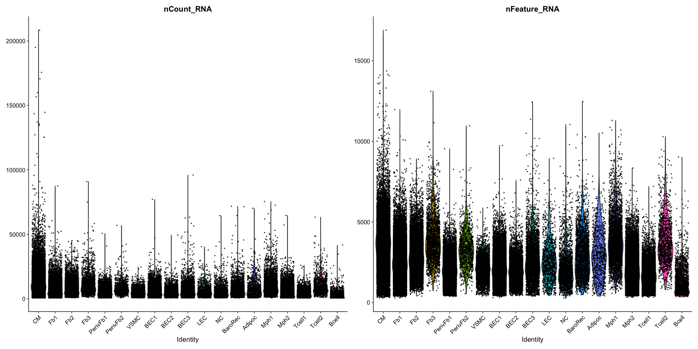<!-- -->

``` r
#Mitochondrial Genes
Mito.gene <-Seurat::PercentageFeatureSet(seuratM, pattern="^MT-", col.name = "percent.mito")
Seurat::VlnPlot(Mito.gene, features = ("percent.mito"))
```

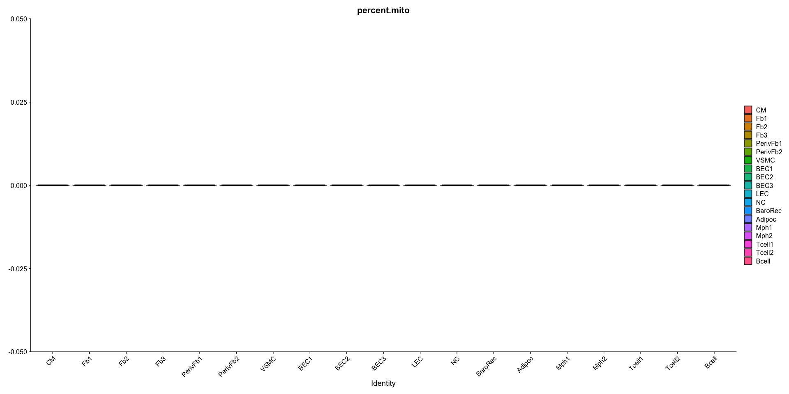<!-- -->


``` r
# Extract meta.data from the Seurat object
meta.data <- seuratM@meta.data
# Create the density plot
ptotalpat <- ggplot(data = meta.data, aes(x = total, color = patient, fill = patient)) +
  geom_density(alpha = 0.2) +
  #scale_fill_manual(values = colpat) +
  #scale_color_manual(values = colpat) +
  theme_classic() +
  scale_x_log10() +
  ylab("density") +
  geom_vline(xintercept = 100) +
  theme(legend.text = element_text(size = 10), legend.title = element_text(size = 10))

pdetectedpat <- ggplot(data = meta.data, aes(x = detected, color = patient, fill = patient)) +
  geom_density(alpha = 0.2) +
 #scale_fill_manual(values = colpat) +
  #scale_color_manual(values = colpat) +
  theme_classic() +
  scale_x_log10() +
  ylab("density") +
  geom_vline(xintercept = 100) +
  theme(legend.text = element_text(size = 10), legend.title = element_text(size = 10))

# Return the plots as a list
list(ptotalpat, pdetectedpat)
```

```
## [[1]]
```

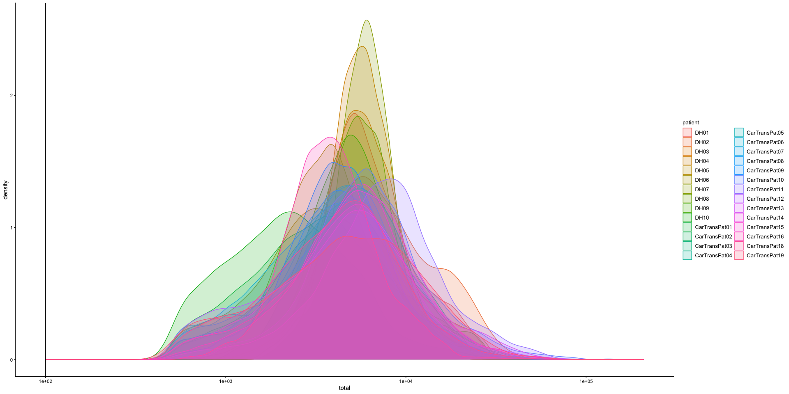<!-- -->

```
## 
## [[2]]
```

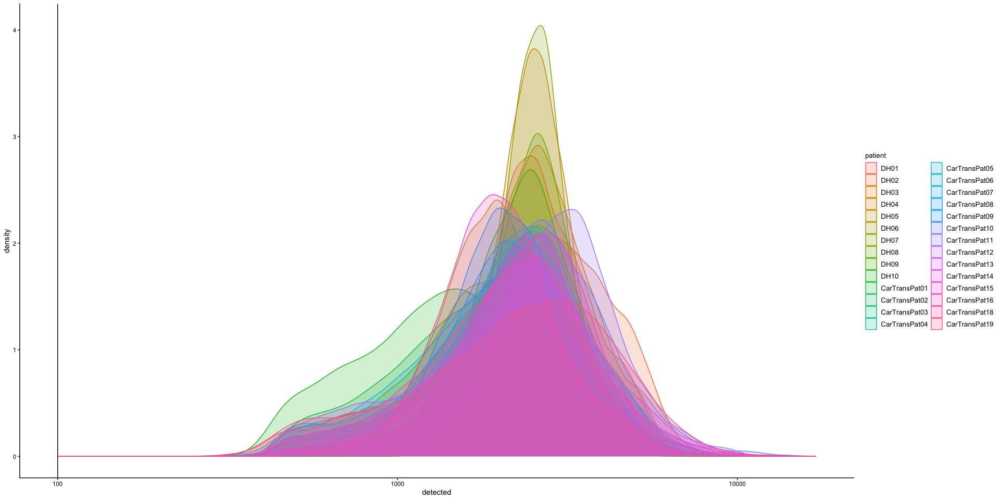<!-- -->


``` r
# Extract meta.data from the Seurat object
meta.data <- seuratM@meta.data
# Create the density plot
ptotalpat <- ggplot(data = meta.data, aes(x = total, color = dataset, fill = dataset)) +
  geom_density(alpha = 0.2) +
  #scale_fill_manual(values = colpat) +
  #scale_color_manual(values = colpat) +
  theme_classic() +
  scale_x_log10() +
  ylab("density") +
  geom_vline(xintercept = 100) +
  theme(legend.text = element_text(size = 10), legend.title = element_text(size = 10))

pdetectedpat <- ggplot(data = meta.data, aes(x = detected, color = dataset, fill = dataset)) +
  geom_density(alpha = 0.2) +
 #scale_fill_manual(values = colpat) +
  #scale_color_manual(values = colpat) +
  theme_classic() +
  scale_x_log10() +
  ylab("density") +
  geom_vline(xintercept = 100) +
  theme(legend.text = element_text(size = 10), legend.title = element_text(size = 10))

# Return the plots as a list
list(ptotalpat, pdetectedpat)
```

```
## [[1]]
```

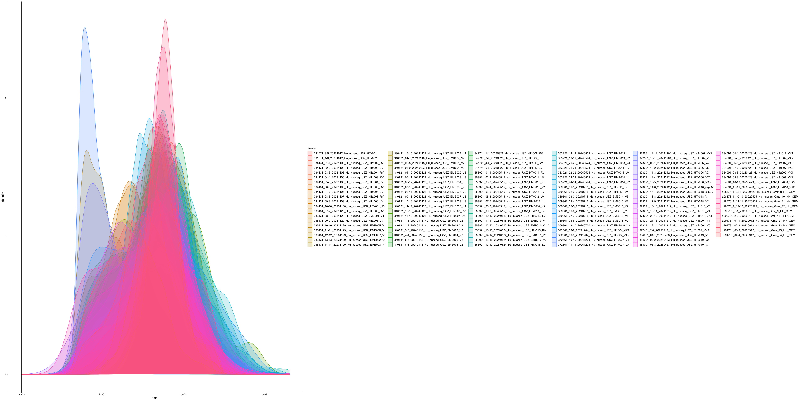<!-- -->

```
## 
## [[2]]
```

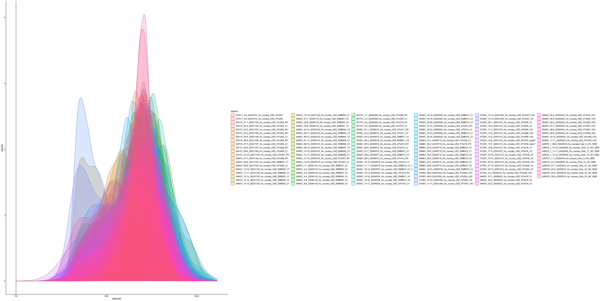<!-- -->


``` r
cell_count <- data.frame(table(seuratM$dataset))
colnames(cell_count) <- c("dataset", "Freq")
hsize <- 1.5

ggplot(cell_count, aes(x = hsize, y = Freq, fill = dataset)) +
  #scale_fill_manual(values = colpat2) +
  geom_col(color = "white") +
  coord_polar(theta = "y") +
  xlim(c(0.2, hsize + 0.5)) +
  theme_void() +
  ggtitle("cell number") +
  theme(plot.title = element_text(hjust = 0.5, size = 10), legend.text = element_text(size = 10), legend.title = element_text(size = 10)) +
  geom_text(aes(label = Freq), position = position_stack(vjust = 0.5), size = 10)
```

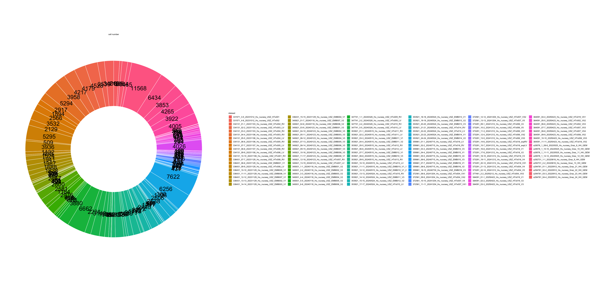<!-- -->

## plot umaps

``` r
Idents(seuratM) <- seuratM$RNA_snn_res.0.25
DimPlot(seuratM, reduction = "umap", pt.size = 0.1, raster = FALSE, label = TRUE) 
```

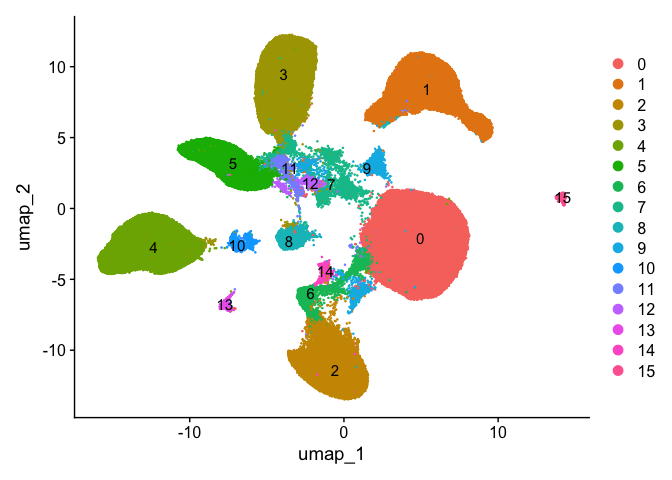<!-- -->

``` r
Idents(seuratM) <- seuratM$RNA_snn_res.0.4
DimPlot(seuratM, reduction = "umap", pt.size = 0.1, raster = FALSE, label = TRUE) 
```

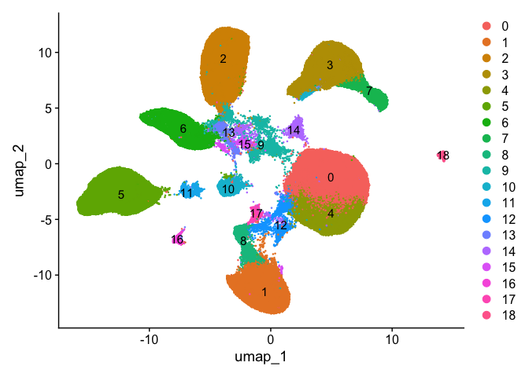<!-- -->

``` r
Idents(seuratM) <- seuratM$RNA_snn_res.0.6
DimPlot(seuratM, reduction = "umap", pt.size = 0.1, raster = FALSE, label = TRUE) 
```

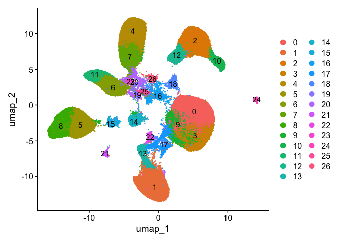<!-- -->

``` r
Idents(seuratM) <- seuratM$patient
DimPlot(seuratM, reduction = "umap", pt.size = 0.1, raster = FALSE) 
```

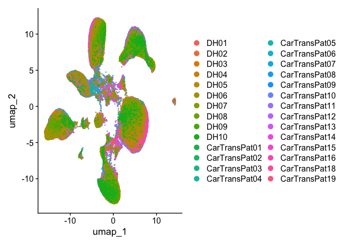<!-- -->

``` r
DimPlot(seuratM, reduction = "umap", pt.size = 0.1, raster = FALSE) + theme(legend.position = "null")
```

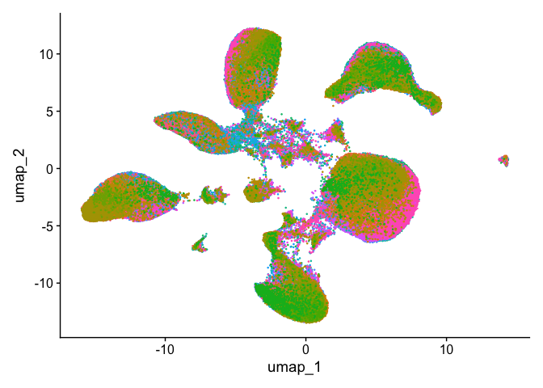<!-- -->

``` r
Idents(seuratM) <- seuratM$clusterName
DimPlot(seuratM, reduction = "umap", pt.size = 0.1, cols = colclusterName, raster = FALSE) 
```

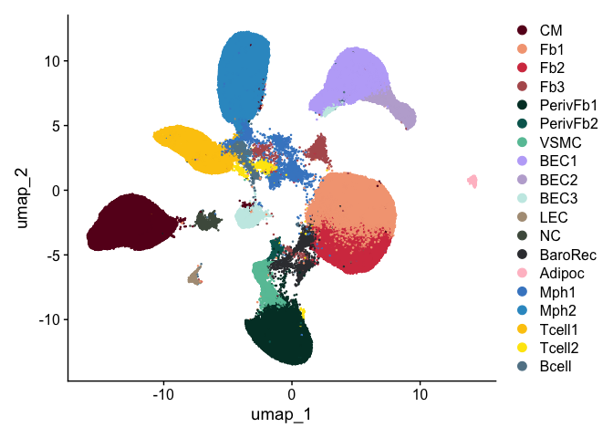<!-- -->

``` r
DimPlot(seuratM, reduction = "umap", pt.size = 0.1, cols = colclusterName, raster = FALSE) + theme(legend.position = "null")
```

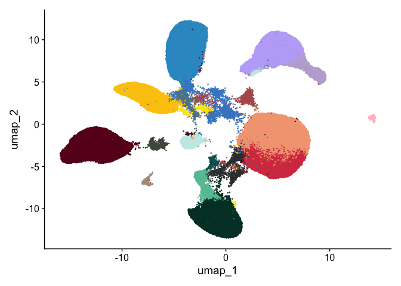<!-- -->

``` r
DimPlot(seuratM, reduction = "umap", pt.size = 0.1, cols = colclusterName, raster = FALSE, label = TRUE) + theme(legend.position = "null")
```

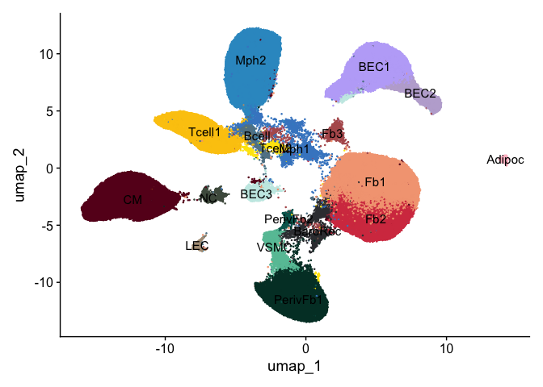<!-- -->

``` r
Idents(seuratM) <- seuratM$diseaseCond
DimPlot(seuratM, reduction = "umap", pt.size = 0.1, cols = coldiseaseCond, shuffle = TRUE, raster=FALSE)
```

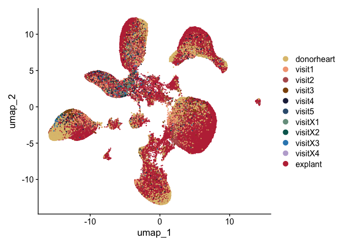<!-- -->

``` r
DimPlot(seuratM, reduction = "umap", pt.size = 0.1, cols = coldiseaseCond, shuffle = TRUE, raster = FALSE) + theme(legend.position = "null")
```

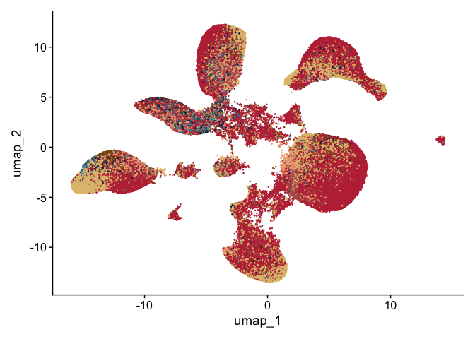<!-- -->


``` r
Idents(seuratM) <- seuratM$diseaseCond
coldiseaseCond <- c("#dfc27d","lightgrey","lightgrey","lightgrey","lightgrey","lightgrey","lightgrey","lightgrey", "lightgrey", "lightgrey", "lightgrey")
names(coldiseaseCond) <- c("donorheart", "explant", "visit1", "visit2" ,"visit3", "visit4", "visit5", "visitX1", "visitX2", "visitX3", "visitX4")
DimPlot(seuratM, reduction = "umap", pt.size = 0.1, cols = coldiseaseCond, order = "donorheart", raster = FALSE) 
```

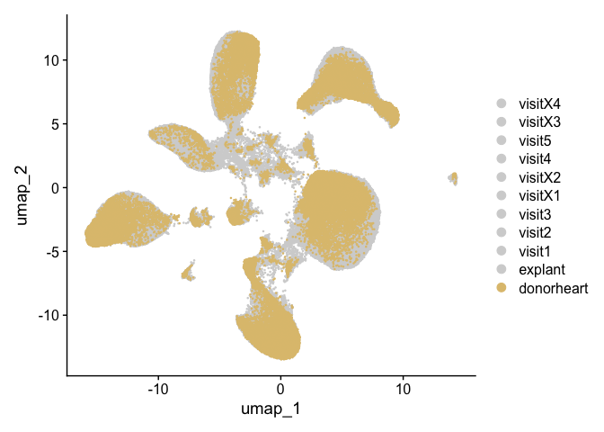<!-- -->

``` r
coldiseaseCond <- c("lightgrey","#BE3144","lightgrey","lightgrey","lightgrey","lightgrey","lightgrey","lightgrey", "lightgrey", "lightgrey", "lightgrey")
names(coldiseaseCond) <- c("donorheart", "explant", "visit1", "visit2" ,"visit3", "visit4", "visit5", "visitX1", "visitX2", "visitX3", "visitX4")
DimPlot(seuratM, reduction = "umap", pt.size = 0.1, cols = coldiseaseCond, order = "explant", raster = FALSE) 
```

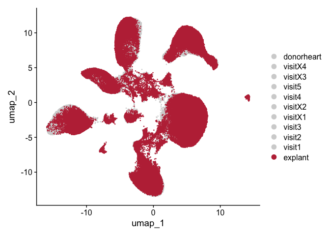<!-- -->

``` r
coldiseaseCond <- c("lightgrey","lightgrey","#f4a582","lightgrey","lightgrey","lightgrey","lightgrey","lightgrey", "lightgrey","lightgrey", "lightgrey")
names(coldiseaseCond) <- c("donorheart", "explant", "visit1", "visit2" ,"visit3", "visit4", "visit5", "visitX1", "visitX2", "visitX3", "visitX4")
DimPlot(seuratM, reduction = "umap", pt.size = 0.1, cols = coldiseaseCond, order = "visit1", raster = FALSE) 
```

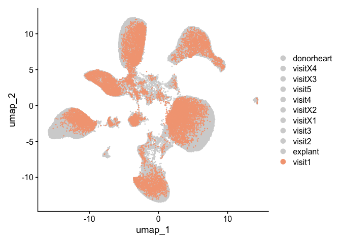<!-- -->

``` r
coldiseaseCond <- c("lightgrey","lightgrey","lightgrey","#B45B5C","lightgrey","lightgrey","lightgrey","lightgrey", "lightgrey", "lightgrey", "lightgrey")
names(coldiseaseCond) <- c("donorheart", "explant", "visit1", "visit2" ,"visit3", "visit4", "visit5", "visitX1", "visitX2", "visitX3", "visitX4")
DimPlot(seuratM, reduction = "umap", pt.size = 0.1, cols = coldiseaseCond, order = "visit2", raster = FALSE)
```

<!-- -->

``` r
coldiseaseCond <- c("lightgrey","lightgrey","lightgrey","lightgrey", "#8c510a","lightgrey","lightgrey","lightgrey", "lightgrey", "lightgrey", "lightgrey")
names(coldiseaseCond) <- c("donorheart", "explant", "visit1", "visit2" ,"visit3", "visit4", "visit5", "visitX1", "visitX2", "visitX3", "visitX4")
DimPlot(seuratM, reduction = "umap", pt.size = 0.1, cols = coldiseaseCond, order = "visit3", raster = FALSE)
```

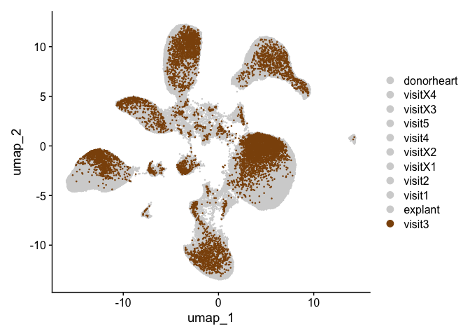<!-- -->

``` r
coldiseaseCond <- c("lightgrey","lightgrey","lightgrey","lightgrey","lightgrey","#202547","lightgrey","lightgrey", "lightgrey","lightgrey", "lightgrey")
names(coldiseaseCond) <- c("donorheart", "explant", "visit1", "visit2" ,"visit3", "visit4", "visit5", "visitX1", "visitX2", "visitX3", "visitX4")
DimPlot(seuratM, reduction = "umap", pt.size = 0.1, cols = coldiseaseCond, order = "visit4", raster = FALSE)
```

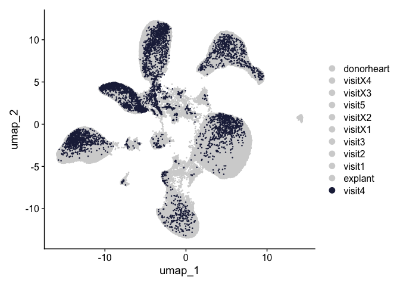<!-- -->

``` r
coldiseaseCond <- c("lightgrey","lightgrey","lightgrey","lightgrey","lightgrey","lightgrey","#355C7D","lightgrey", "lightgrey", "lightgrey", "lightgrey")
names(coldiseaseCond) <- c("donorheart", "explant", "visit1", "visit2" ,"visit3", "visit4", "visit5", "visitX1", "visitX2", "visitX3", "visitX4")
DimPlot(seuratM, reduction = "umap", pt.size = 0.1, cols = coldiseaseCond, order = "visit5", raster = FALSE)
```

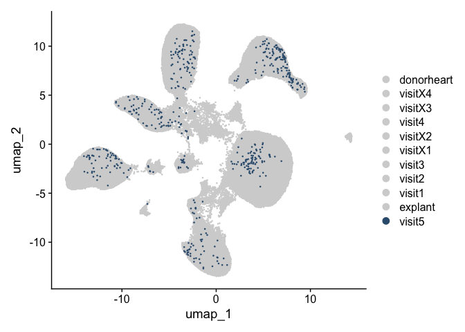<!-- -->

``` r
coldiseaseCond <- c("lightgrey","lightgrey","lightgrey","lightgrey","lightgrey","lightgrey","lightgrey","#779d8d", "lightgrey", "lightgrey", "lightgrey")
names(coldiseaseCond) <- c("donorheart", "explant", "visit1", "visit2" ,"visit3", "visit4", "visit5", "visitX1", "visitX2", "visitX3", "visitX4")
DimPlot(seuratM, reduction = "umap", pt.size = 0.1, cols = coldiseaseCond, order = "visitX1", raster = FALSE)
```

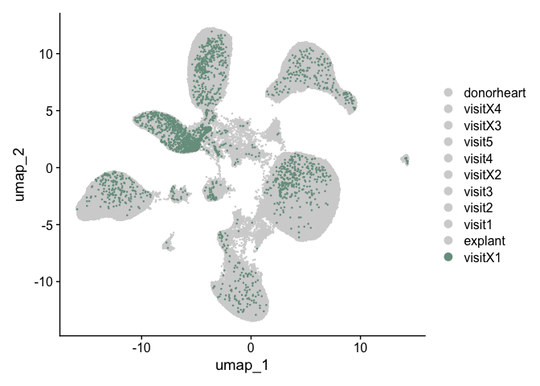<!-- -->

``` r
coldiseaseCond <- c("lightgrey","lightgrey","lightgrey","lightgrey","lightgrey","lightgrey","lightgrey", "lightgrey", "#01665e", "lightgrey", "lightgrey")
names(coldiseaseCond) <- c("donorheart", "explant", "visit1", "visit2" ,"visit3", "visit4", "visit5", "visitX1", "visitX2", "visitX3", "visitX4")
DimPlot(seuratM, reduction = "umap", pt.size = 0.1, cols = coldiseaseCond, order = "visitX2", raster = FALSE)
```

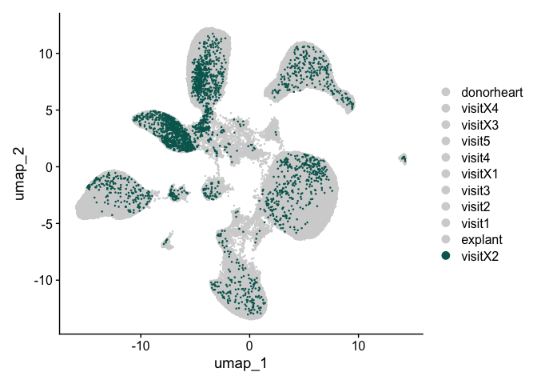<!-- -->

``` r
coldiseaseCond <- c("lightgrey","lightgrey","lightgrey","lightgrey","lightgrey","lightgrey","lightgrey", "lightgrey", "lightgrey", "#3288BD", "lightgrey")
names(coldiseaseCond) <- c("donorheart", "explant", "visit1", "visit2" ,"visit3", "visit4", "visit5", "visitX1", "visitX2", "visitX3", "visitX4")
DimPlot(seuratM, reduction = "umap", pt.size = 0.1, cols = coldiseaseCond, order = "visitX3", raster = FALSE)
```

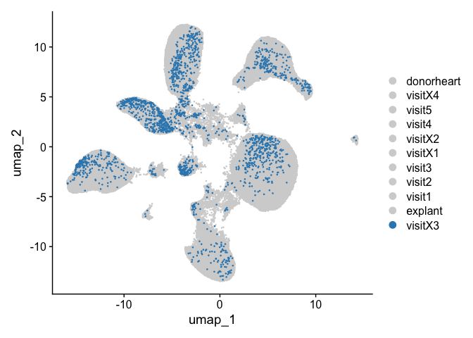<!-- -->

``` r
coldiseaseCond <- c("lightgrey","lightgrey","lightgrey","lightgrey","lightgrey","lightgrey","lightgrey", "lightgrey", "lightgrey", "lightgrey", "#BEAED4")
names(coldiseaseCond) <- c("donorheart", "explant", "visit1", "visit2" ,"visit3", "visit4", "visit5", "visitX1", "visitX2", "visitX3", "visitX4")
DimPlot(seuratM, reduction = "umap", pt.size = 0.1, cols = coldiseaseCond, order = "visitX4", raster = FALSE)
```

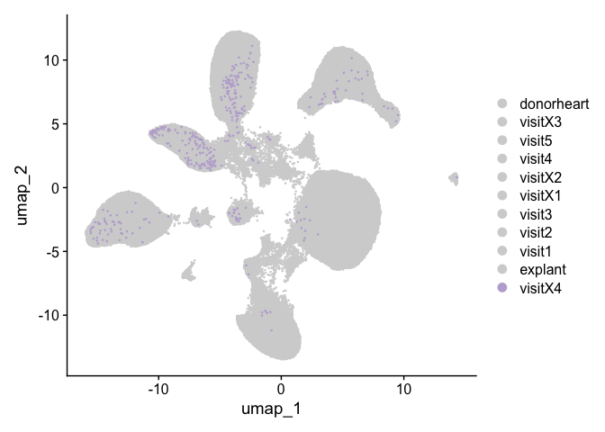<!-- -->

``` r
##reset coldiseaseCond
coldiseaseCond <- c("#dfc27d","#BE3144","#f4a582","#B45B5C","#8c510a","#202547","#355C7D","#779d8d", "#01665e", "#3288BD", "#BEAED4") 
names(coldiseaseCond) <- c("donorheart", "explant", "visit1", "visit2", "visit3", "visit4", "visit5", "visitX1", "visitX2", "visitX3", "visitX4")
```

## session info

``` r
date()
```

```
## [1] "Mon Sep 29 19:33:36 2025"
```

``` r
sessionInfo()
```

```
## R version 4.5.1 (2025-06-13)
## Platform: aarch64-apple-darwin20
## Running under: macOS Sequoia 15.1
## 
## Matrix products: default
## BLAS:   /Library/Frameworks/R.framework/Versions/4.5-arm64/Resources/lib/libRblas.0.dylib 
## LAPACK: /Library/Frameworks/R.framework/Versions/4.5-arm64/Resources/lib/libRlapack.dylib;  LAPACK version 3.12.1
## 
## locale:
## [1] en_US.UTF-8/en_US.UTF-8/en_US.UTF-8/C/en_US.UTF-8/en_US.UTF-8
## 
## time zone: Europe/Zurich
## tzcode source: internal
## 
## attached base packages:
## [1] grid      stats4    stats     graphics  grDevices utils     datasets  methods   base     
## 
## other attached packages:
##  [1] NCmisc_1.2.0                VennDiagram_1.7.3           futile.logger_1.4.3        
##  [4] ggupset_0.4.1               gridExtra_2.3               DOSE_4.2.0                 
##  [7] enrichplot_1.28.4           msigdbr_25.1.1              org.Hs.eg.db_3.21.0        
## [10] AnnotationDbi_1.70.0        clusterProfiler_4.16.0      multtest_2.64.0            
## [13] metap_1.12                  scater_1.35.0               scuttle_1.18.0             
## [16] destiny_3.22.0              circlize_0.4.16             muscat_1.22.0              
## [19] viridis_0.6.5               viridisLite_0.4.2           lubridate_1.9.4            
## [22] forcats_1.0.1               stringr_1.5.2               purrr_1.1.0                
## [25] readr_2.1.5                 tidyr_1.3.1                 tibble_3.3.0               
## [28] tidyverse_2.0.0             dplyr_1.1.4                 SingleCellExperiment_1.30.1
## [31] SummarizedExperiment_1.38.1 Biobase_2.68.0              GenomicRanges_1.60.0       
## [34] GenomeInfoDb_1.44.3         IRanges_2.42.0              S4Vectors_0.46.0           
## [37] BiocGenerics_0.54.0         generics_0.1.4              MatrixGenerics_1.20.0      
## [40] matrixStats_1.5.0           pheatmap_1.0.13             ggpubr_0.6.1               
## [43] ggplot2_4.0.0               Seurat_5.3.0                SeuratObject_5.2.0         
## [46] sp_2.2-0                   
## 
## loaded via a namespace (and not attached):
##   [1] igraph_2.1.4             ica_1.0-3                plotly_4.11.0           
##   [4] Formula_1.2-5            tidyselect_1.2.1         bit_4.6.0               
##   [7] doParallel_1.0.17        clue_0.3-66              lattice_0.22-7          
##  [10] rjson_0.2.23             blob_1.2.4               S4Arrays_1.8.1          
##  [13] pbkrtest_0.5.5           parallel_4.5.1           png_0.1-8               
##  [16] plotrix_3.8-4            cli_3.6.5                ggplotify_0.1.3         
##  [19] goftest_1.2-3            VIM_6.2.6                variancePartition_1.38.1
##  [22] BiocNeighbors_2.2.0      uwot_0.2.3               curl_7.0.0              
##  [25] mime_0.13                evaluate_1.0.5           tidytree_0.4.6          
##  [28] ComplexHeatmap_2.24.1    stringi_1.8.7            backports_1.5.0         
##  [31] lmerTest_3.1-3           qqconf_1.3.2             httpuv_1.6.16           
##  [34] magrittr_2.0.4           rappdirs_0.3.3           splines_4.5.1           
##  [37] sctransform_0.4.2        ggbeeswarm_0.7.2         DBI_1.2.3               
##  [40] jquerylib_0.1.4          smoother_1.3             withr_3.0.2             
##  [43] corpcor_1.6.10           reformulas_0.4.1         class_7.3-23            
##  [46] lmtest_0.9-40            formatR_1.14             htmlwidgets_1.6.4       
##  [49] fs_1.6.6                 ggrepel_0.9.6            labeling_0.4.3          
##  [52] fANCOVA_0.6-1            SparseArray_1.8.1        DESeq2_1.48.2           
##  [55] ranger_0.17.0            DEoptimR_1.1-4           reticulate_1.43.0       
##  [58] hexbin_1.28.5            zoo_1.8-14               XVector_0.48.0          
##  [61] knitr_1.50               ggplot.multistats_1.0.1  UCSC.utils_1.4.0        
##  [64] RhpcBLASctl_0.23-42      timechange_0.3.0         foreach_1.5.2           
##  [67] patchwork_1.3.2          caTools_1.18.3           data.table_1.17.8       
##  [70] ggtree_3.16.3            R.oo_1.27.1              RSpectra_0.16-2         
##  [73] irlba_2.3.5.1            ggrastr_1.0.2            fastDummies_1.7.5       
##  [76] gridGraphics_0.5-1       lazyeval_0.2.2           yaml_2.3.10             
##  [79] survival_3.8-3           scattermore_1.2          crayon_1.5.3            
##  [82] RcppAnnoy_0.0.22         RColorBrewer_1.1-3       progressr_0.16.0        
##  [85] later_1.4.4              ggridges_0.5.7           codetools_0.2-20        
##  [88] GlobalOptions_0.1.2      aod_1.3.3                KEGGREST_1.48.1         
##  [91] Rtsne_0.17               shape_1.4.6.1            limma_3.64.3            
##  [94] pkgconfig_2.0.3          TMB_1.9.17               spatstat.univar_3.1-4   
##  [97] mathjaxr_1.8-0           EnvStats_3.1.0           aplot_0.2.9             
## [100] scatterplot3d_0.3-44     spatstat.sparse_3.1-0    ape_5.8-1               
## [103] xtable_1.8-4             car_3.1-3                plyr_1.8.9              
## [106] httr_1.4.7               rbibutils_2.3            tools_4.5.1             
## [109] globals_0.18.0           beeswarm_0.4.0           broom_1.0.10            
## [112] nlme_3.1-168             lambda.r_1.2.4           assertthat_0.2.1        
## [115] lme4_1.1-37              digest_0.6.37            numDeriv_2016.8-1.1     
## [118] Matrix_1.7-4             farver_2.1.2             tzdb_0.5.0              
## [121] remaCor_0.0.20           reshape2_1.4.4           yulab.utils_0.2.1       
## [124] glue_1.8.0               cachem_1.1.0             polyclip_1.10-7         
## [127] Biostrings_2.76.0        mvtnorm_1.3-3            parallelly_1.45.1       
## [130] mnormt_2.1.1             statmod_1.5.0            RcppHNSW_0.6.0          
## [133] ScaledMatrix_1.16.0      carData_3.0-5            minqa_1.2.8             
## [136] pbapply_1.7-4            spam_2.11-1              gson_0.1.0              
## [139] gtools_3.9.5             ggsignif_0.6.4           RcppEigen_0.3.4.0.2     
## [142] shiny_1.11.1             GenomeInfoDbData_1.2.14  glmmTMB_1.1.12          
## [145] R.utils_2.13.0           memoise_2.0.1            rmarkdown_2.29          
## [148] scales_1.4.0             R.methodsS3_1.8.2        future_1.67.0           
## [151] RANN_2.6.2               Cairo_1.6-5              spatstat.data_3.1-8     
## [154] rstudioapi_0.17.1        cluster_2.1.8.1          mutoss_0.1-13           
## [157] spatstat.utils_3.2-0     hms_1.1.3                fitdistrplus_1.2-4      
## [160] cowplot_1.2.0            colorspace_2.1-2         rlang_1.1.6             
## [163] xts_0.14.1               dotCall64_1.2            ggtangle_0.0.7          
## [166] laeken_0.5.3             mgcv_1.9-3               xfun_0.53               
## [169] e1071_1.7-16             TH.data_1.1-4            iterators_1.0.14        
## [172] abind_1.4-8              GOSemSim_2.34.0          treeio_1.32.0           
## [175] futile.options_1.0.1     bitops_1.0-9             Rdpack_2.6.4            
## [178] promises_1.3.3           RSQLite_2.4.3            qvalue_2.40.0           
## [181] sandwich_3.1-1           fgsea_1.34.2             DelayedArray_0.34.1     
## [184] proxy_0.4-27             GO.db_3.21.0             compiler_4.5.1          
## [187] prettyunits_1.2.0        boot_1.3-32              beachmat_2.24.0         
## [190] listenv_0.9.1            Rcpp_1.1.0               edgeR_4.6.3             
## [193] BiocSingular_1.24.0      tensor_1.5.1             MASS_7.3-65             
## [196] progress_1.2.3           BiocParallel_1.42.2      babelgene_22.9          
## [199] spatstat.random_3.4-2    R6_2.6.1                 fastmap_1.2.0           
## [202] multcomp_1.4-28          fastmatch_1.1-6          rstatix_0.7.2           
## [205] vipor_0.4.7              TTR_0.24.4               ROCR_1.0-11             
## [208] TFisher_0.2.0            rsvd_1.0.5               vcd_1.4-13              
## [211] nnet_7.3-20              gtable_0.3.6             KernSmooth_2.23-26      
## [214] miniUI_0.1.2             deldir_2.0-4             htmltools_0.5.8.1       
## [217] ggthemes_5.1.0           bit64_4.6.0-1            spatstat.explore_3.5-3  
## [220] lifecycle_1.0.4          blme_1.0-6               S7_0.2.0                
## [223] nloptr_2.2.1             sass_0.4.10              vctrs_0.6.5             
## [226] robustbase_0.99-6        spatstat.geom_3.6-0      sn_2.1.1                
## [229] ggfun_0.2.0              future.apply_1.20.0      bslib_0.9.0             
## [232] pillar_1.11.1            gplots_3.2.0             pcaMethods_2.0.0        
## [235] locfit_1.5-9.12          jsonlite_2.0.0           GetoptLong_1.0.5
```
