## load packages


## load object All

``` r
fileNam <- "/Users/immbio/Desktop/HumanHeartCarTrans2/data/Human_heart_allmerged_seurat.rds"
seuratM <- readRDS(fileNam)
```


``` r
seuratM$clusterName <- "clusterName"
seuratM$clusterName[which(seuratM$RNA_snn_res.0.4 %in% "0" )] <- "Fb1"
seuratM$clusterName[which(seuratM$RNA_snn_res.0.4 %in% "1" )] <- "PerivFb1"
seuratM$clusterName[which(seuratM$RNA_snn_res.0.4 %in% "2" )] <- "Mph2"
seuratM$clusterName[which(seuratM$RNA_snn_res.0.4 %in% "3" )] <- "BEC1"
seuratM$clusterName[which(seuratM$RNA_snn_res.0.4 %in% "4" )] <- "Fb2"
seuratM$clusterName[which(seuratM$RNA_snn_res.0.4 %in% "5" )] <- "CM"
seuratM$clusterName[which(seuratM$RNA_snn_res.0.4 %in% "6" )] <- "Tcell1"
seuratM$clusterName[which(seuratM$RNA_snn_res.0.4 %in% "7" )] <- "BEC2"
seuratM$clusterName[which(seuratM$RNA_snn_res.0.4 %in% "8" )] <- "VSMC"
seuratM$clusterName[which(seuratM$RNA_snn_res.0.4 %in% "9" )] <- "Mph1"
seuratM$clusterName[which(seuratM$RNA_snn_res.0.4 %in% "10" )] <- "BEC3"
seuratM$clusterName[which(seuratM$RNA_snn_res.0.4 %in% "11" )] <- "NC"
seuratM$clusterName[which(seuratM$RNA_snn_res.0.4 %in% "12" )] <- "BaroRec"
seuratM$clusterName[which(seuratM$RNA_snn_res.0.4 %in% "13" )] <- "Bcell"
seuratM$clusterName[which(seuratM$RNA_snn_res.0.4 %in% "14" )] <- "Fb3"
seuratM$clusterName[which(seuratM$RNA_snn_res.0.4 %in% "15" )] <- "Tcell2"
seuratM$clusterName[which(seuratM$RNA_snn_res.0.4 %in% "16" )] <- "LEC"
seuratM$clusterName[which(seuratM$RNA_snn_res.0.4 %in% "17" )] <- "PerivFb2"
seuratM$clusterName[which(seuratM$RNA_snn_res.0.4 %in% "18" )] <- "Adipoc"

colclusterName <- c("#67001f", "#f4a582","#D53E4F", "#B45B5C","#003c30","#01665e","#66C2A5", "#BEAEF8","#BEAED4", "#c7eae5", "#B09C85", "#4e5a4c","#393A3F","pink","#4588CA","#3299CA","#FCC80B","#FEE60B","#628395")
names(colclusterName) <- c("CM","Fb1","Fb2","Fb3","PerivFb1","PerivFb2","VSMC","BEC1","BEC2","BEC3","LEC","NC","BaroRec","Adipoc","Mph1","Mph2","Tcell1","Tcell2","Bcell")

coldiseaseCond <- c("#dfc27d","#BE3144","#f4a582","#B45B5C","#8c510a","#202547","#355C7D","#779d8d", "#01665e", "#3288BD", "#BEAED4") 
names(coldiseaseCond) <- c("donorheart", "explant", "visit1", "visit2", "visit3", "visit4", "visit5", "visitX1", "visitX2", "visitX3", "visitX4")
```

## plot features

``` r
##Fb
FeaturePlot(seuratM, features = "ENSG00000026025.VIM", pt.size = 0.5, cols = c("lightgrey", "#BE3144"), raster = FALSE)
```

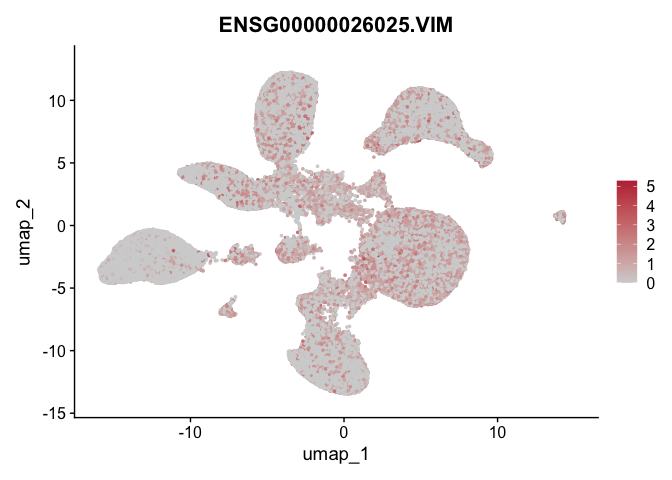<!-- -->

``` r
FeaturePlot(seuratM, features = "ENSG00000163359.COL6A3", pt.size = 0.5, cols = c("lightgrey", "#BE3144"), raster = FALSE)
```

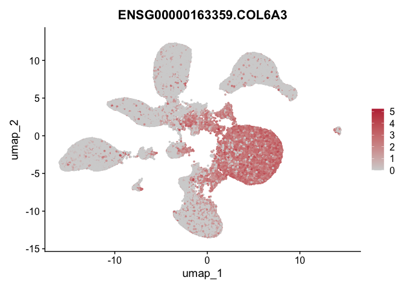<!-- -->

``` r
FeaturePlot(seuratM, features = "ENSG00000091136.LAMB1", pt.size = 0.5, cols = c("lightgrey", "#BE3144"), raster = FALSE)
```

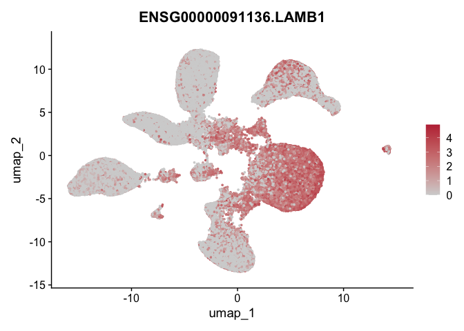<!-- -->

``` r
FeaturePlot(seuratM, features = "ENSG00000011465.DCN", pt.size = 0.5, cols = c("lightgrey", "#BE3144"), raster = FALSE)
```

<!-- -->

``` r
FeaturePlot(seuratM, features = "ENSG00000196569.LAMA2", pt.size = 0.5, cols = c("lightgrey", "#BE3144"), raster = FALSE)
```

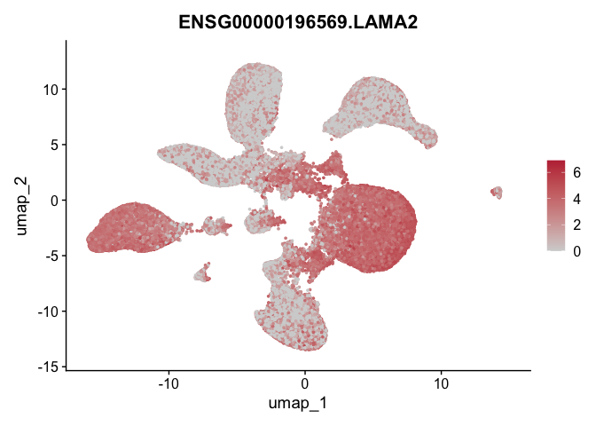<!-- -->

``` r
FeaturePlot(seuratM, features = "ENSG00000011465.DCN", pt.size = 0.5, cols = c("lightgrey", "#BE3144"), raster = FALSE)
```

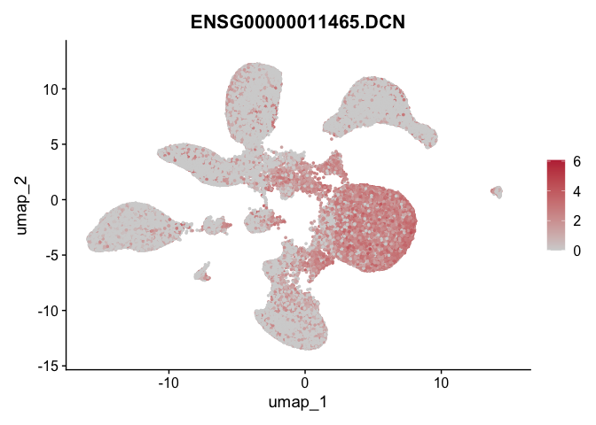<!-- -->

``` r
FeaturePlot(seuratM, features = "ENSG00000071991.CDH19", pt.size = 0.5, cols = c("lightgrey", "#BE3144"), raster = FALSE)
```

<!-- -->


``` r
##PerivFb/VSMC
FeaturePlot(seuratM, features = "ENSG00000113721.PDGFRB", pt.size = 0.5, cols = c("lightgrey", "#BE3144"), raster = FALSE)
```

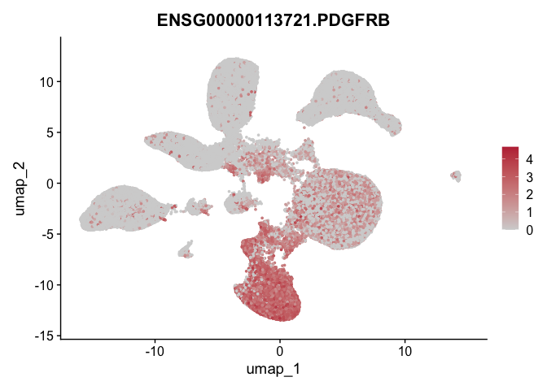<!-- -->

``` r
FeaturePlot(seuratM, features = "ENSG00000143248.RGS5", pt.size = 0.5, cols = c("lightgrey", "#BE3144"), raster = FALSE)
```

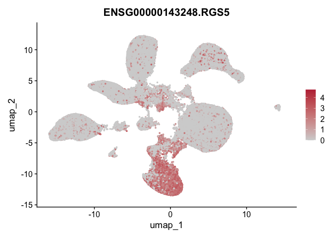<!-- -->

``` r
FeaturePlot(seuratM, features = "ENSG00000076706.MCAM", pt.size = 0.5, cols = c("lightgrey", "#BE3144"), raster = FALSE)
```

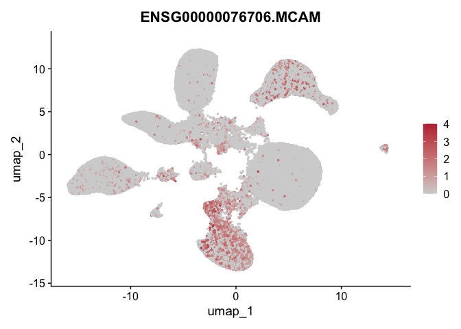<!-- -->

``` r
FeaturePlot(seuratM, features = "ENSG00000135424.ITGA7", pt.size = 0.5, cols = c("lightgrey", "#BE3144"), raster = FALSE)
```

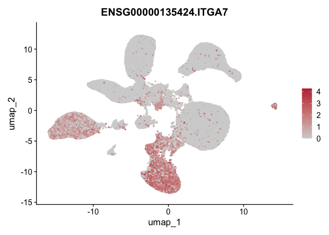<!-- -->

``` r
FeaturePlot(seuratM, features = "ENSG00000107796.ACTA2", pt.size = 0.5, cols = c("lightgrey", "#BE3144"), raster = FALSE)
```

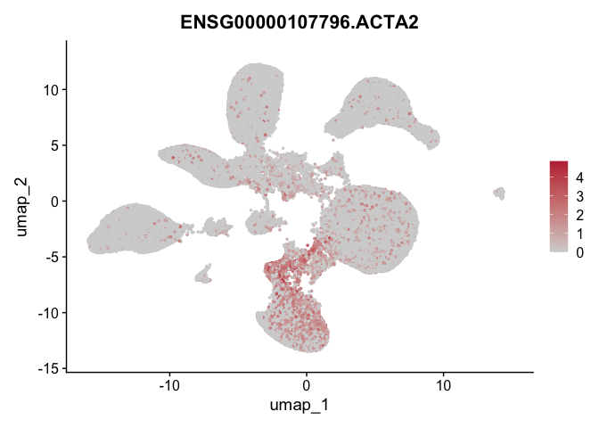<!-- -->


``` r
##CM
FeaturePlot(seuratM, features = "ENSG00000197616.MYH6", pt.size = 0.5, cols = c("lightgrey", "#BE3144"), raster = FALSE)
```

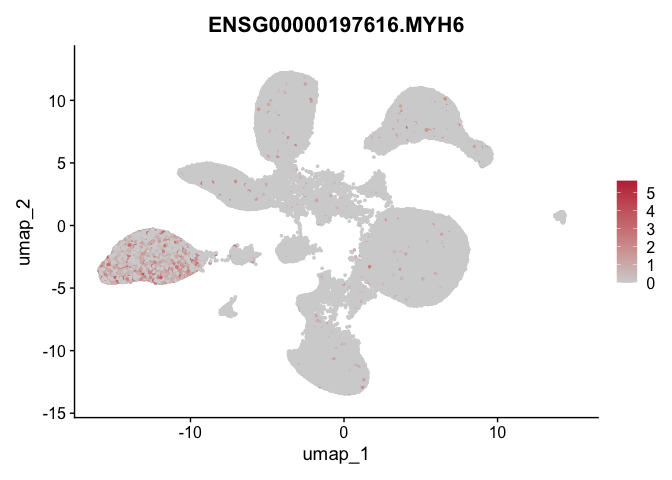<!-- -->

``` r
FeaturePlot(seuratM, features = "ENSG00000078814.MYH7B", pt.size = 0.5, cols = c("lightgrey", "#BE3144"), raster = FALSE)
```

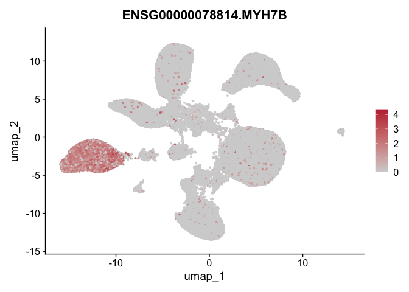<!-- -->

``` r
FeaturePlot(seuratM, features = "ENSG00000134571.MYBPC3", pt.size = 0.5, cols = c("lightgrey", "#BE3144"), raster = FALSE)
```

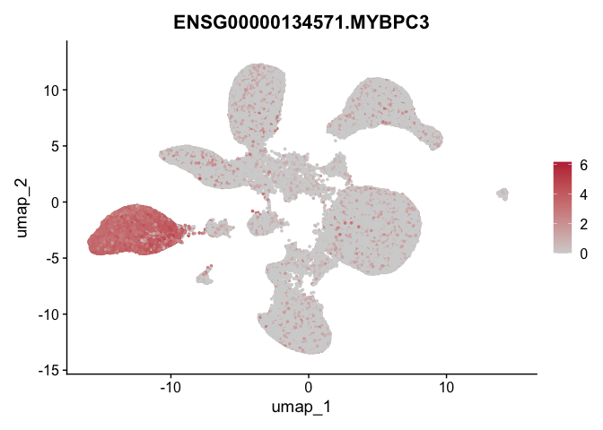<!-- -->

``` r
FeaturePlot(seuratM, features = "ENSG00000092054.MYH7", pt.size = 0.5, cols = c("lightgrey", "#BE3144"), raster = FALSE)
```

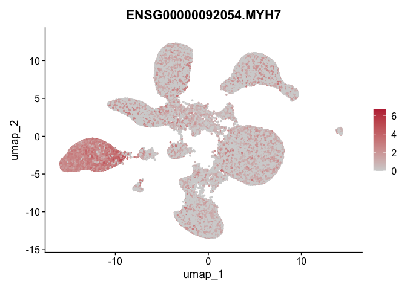<!-- -->

``` r
FeaturePlot(seuratM, features = "ENSG00000198626.RYR2", pt.size = 0.5, cols = c("lightgrey", "#BE3144"), raster = FALSE)
```

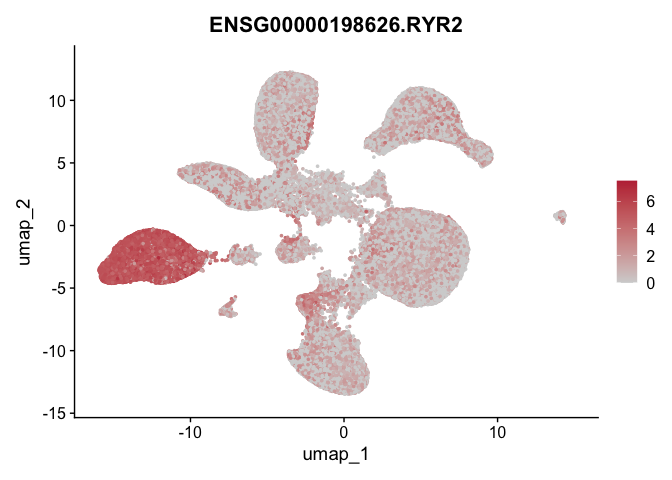<!-- -->

``` r
FeaturePlot(seuratM, features = "ENSG00000078114.NEBL", pt.size = 0.5, cols = c("lightgrey", "#BE3144"), raster = FALSE)
```

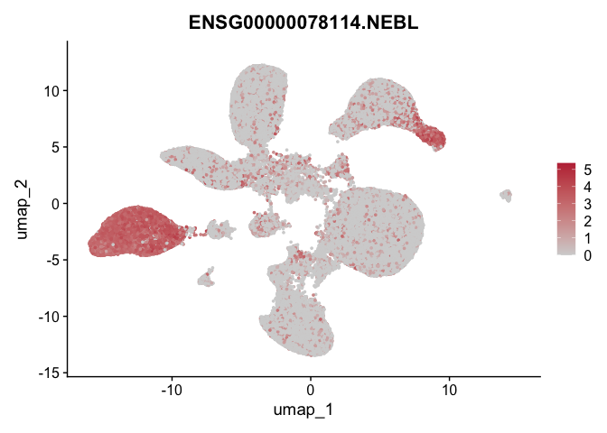<!-- -->

``` r
FeaturePlot(seuratM, features = "ENSG00000175084.DES", pt.size = 0.5, cols = c("lightgrey", "#BE3144"), raster = FALSE)
```

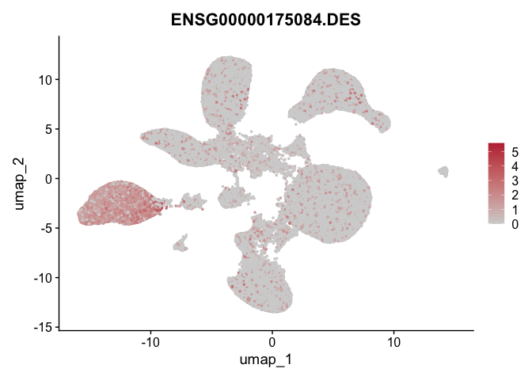<!-- -->

``` r
FeaturePlot(seuratM, features = "ENSG00000155657.TTN", pt.size = 0.5, cols = c("lightgrey", "#BE3144"), raster = FALSE)
```

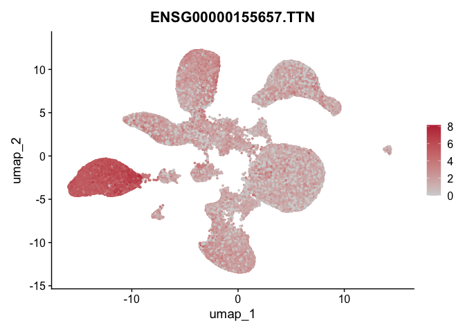<!-- -->

``` r
FeaturePlot(seuratM, features = "ENSG00000118194.TNNT2", pt.size = 0.5, cols = c("lightgrey", "#BE3144"), raster = FALSE)
```

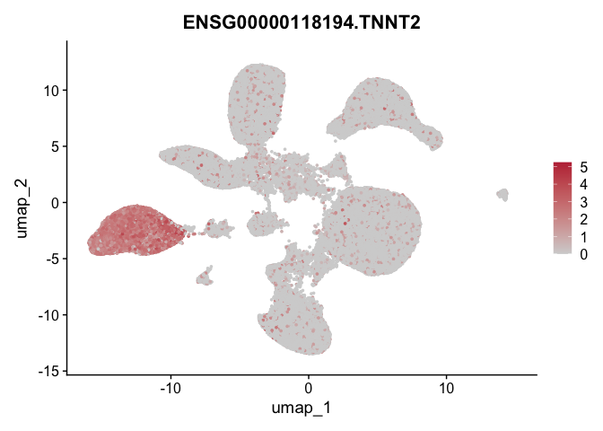<!-- -->


``` r
#B cells
FeaturePlot(seuratM, features = "ENSG00000177455.CD19", pt.size = 0.5, cols = c("lightgrey", "#BE3144"), raster = FALSE)
```

<!-- -->

``` r
FeaturePlot(seuratM, features = "ENSG00000012124.CD22", pt.size = 0.5, cols = c("lightgrey", "#BE3144"), raster = FALSE) #mature Bcells
```

<!-- -->

``` r
FeaturePlot(seuratM, features = "ENSG00000143297.FCRL5", pt.size = 0.5, cols = c("lightgrey", "#BE3144"), raster = FALSE) #Plasmacells
```

<!-- -->

``` r
FeaturePlot(seuratM, features = "ENSG00000156738.MS4A1", pt.size = 0.5, cols = c("lightgrey", "#BE3144"), raster = FALSE) #CD20, mature Bcells
```

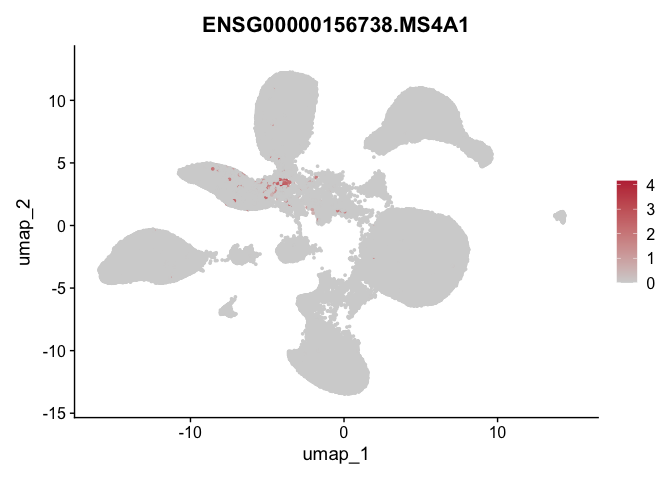<!-- -->

``` r
FeaturePlot(seuratM, features = "ENSG00000211592.IGKC", pt.size = 0.5, cols = c("lightgrey", "#BE3144"), raster = FALSE) 
```

<!-- -->

``` r
FeaturePlot(seuratM, features = "ENSG00000211899.IGHM", pt.size = 0.5, cols = c("lightgrey", "#BE3144"), raster = FALSE) 
```

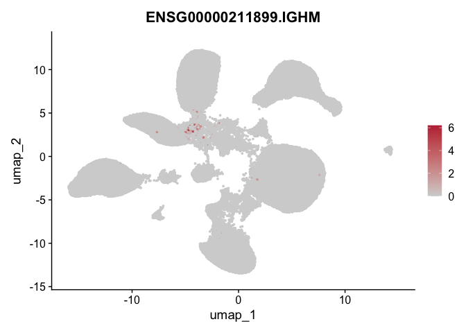<!-- -->

``` r
FeaturePlot(seuratM, features = "ENSG00000196092.PAX5", pt.size = 0.5, cols = c("lightgrey", "#BE3144"), raster = FALSE) 
```

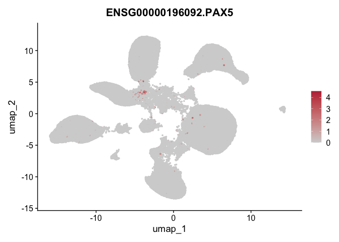<!-- -->


``` r
#T cells
FeaturePlot(seuratM, features = "ENSG00000198851.CD3E", pt.size = 0.5, cols = c("lightgrey", "#BE3144"), raster = FALSE) 
```

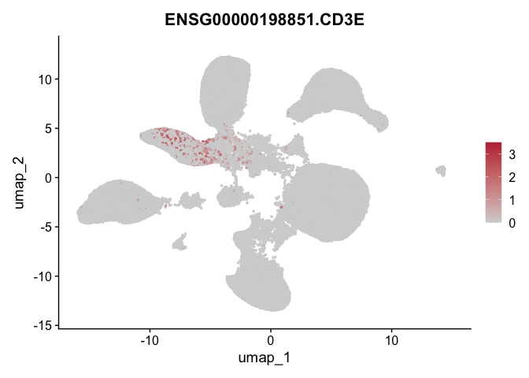<!-- -->

``` r
FeaturePlot(seuratM, features = "ENSG00000010610.CD4", pt.size = 0.5, cols = c("lightgrey", "#BE3144"), raster = FALSE) 
```

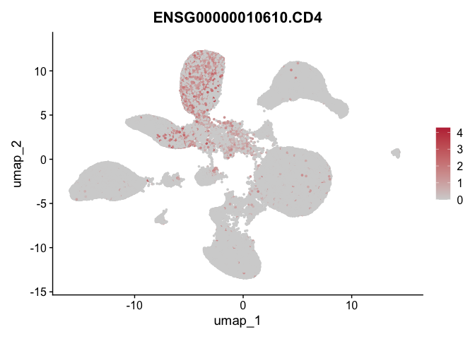<!-- -->


## sel features 

``` r
genes <- data.frame(gene=rownames(seuratM)) %>% 
  mutate(geneID=gsub("^.*\\.", "", gene))

selGenes <- data.frame(geneID=c("ACTA2", "MYH6", "COL1A1", "MYH11")) %>% 
  left_join(., genes, by="geneID")

pList <- sapply(selGenes$gene, function(x){
  p <- FeaturePlot(seuratM, features = x, reduction = "umap", pt.size = 0.1, cols = c("lightgrey", "#BE3144"), raster = FALSE) +
    theme(legend.position="right")
  plot(p)
})
```

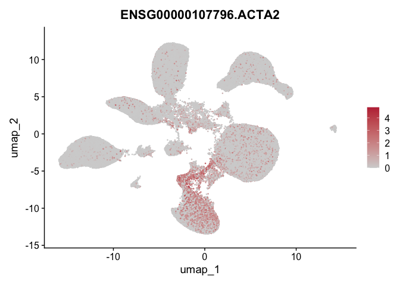<!-- -->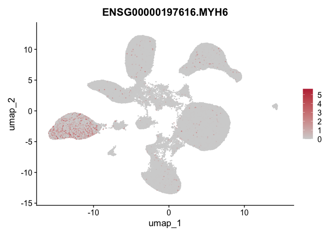<!-- --><!-- -->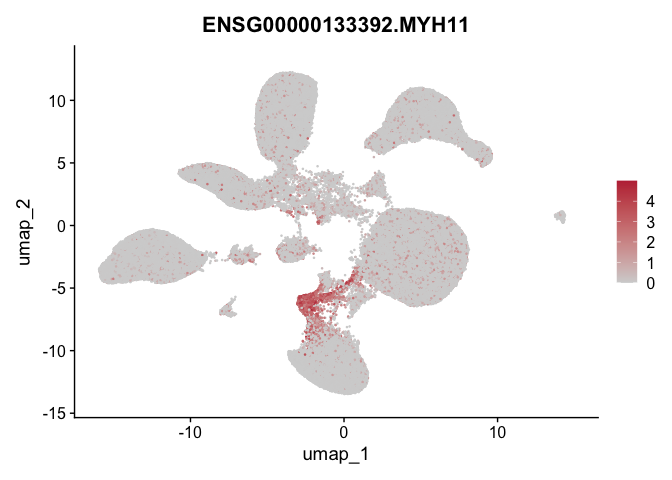<!-- -->

## dotplot inflammatory genes

``` r
genes <- data.frame(gene=rownames(seuratM)) %>% 
  mutate(geneID=gsub("^.*\\.", "", gene))

selGenes <- data.frame(geneID=c("IL1B", "IL1R1", "IL6", "IL6R", "TNF", "TNFRSF1A", "TNFRSF1B", "IL18", "IL18R1", "IL15", "IL15RA", "IFNG", "IFNGR1", "IFNG-AS1", "IFNAR1", "IFNAR2", "IFNA5")) %>% left_join(., genes, by="geneID")

#DotPlot(seuratM, features = selGenes, group.by= "clusterName") + RotatedAxis() + scale_color_viridis(option="F") + coord_flip()
```
Dotplot is not working with R 4.5.1 right know

## BMP features

``` r
genes <- data.frame(gene=rownames(seuratM)) %>% 
  mutate(geneID=gsub("^.*\\.", "", gene))

selGenes <- data.frame(geneID=c("BMPER")) %>% 
  left_join(., genes, by="geneID")

pList <- sapply(selGenes$gene, function(x){
  p <- FeaturePlot(seuratM, features = x, reduction = "umap", pt.size = 0.1, cols = c("lightgrey", "#BE3144"), raster = FALSE) +
    theme(legend.position="right")
  plot(p)
})
```

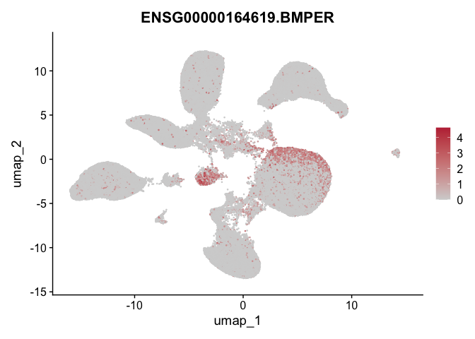<!-- -->

## session info

``` r
date()
```

```
## [1] "Mon Sep 29 19:45:31 2025"
```

``` r
sessionInfo()
```

```
## R version 4.5.1 (2025-06-13)
## Platform: aarch64-apple-darwin20
## Running under: macOS Sequoia 15.1
## 
## Matrix products: default
## BLAS:   /Library/Frameworks/R.framework/Versions/4.5-arm64/Resources/lib/libRblas.0.dylib 
## LAPACK: /Library/Frameworks/R.framework/Versions/4.5-arm64/Resources/lib/libRlapack.dylib;  LAPACK version 3.12.1
## 
## locale:
## [1] en_US.UTF-8/en_US.UTF-8/en_US.UTF-8/C/en_US.UTF-8/en_US.UTF-8
## 
## time zone: Europe/Zurich
## tzcode source: internal
## 
## attached base packages:
## [1] grid      stats4    stats     graphics  grDevices utils     datasets  methods   base     
## 
## other attached packages:
##  [1] NCmisc_1.2.0                VennDiagram_1.7.3           futile.logger_1.4.3        
##  [4] ggupset_0.4.1               gridExtra_2.3               DOSE_4.2.0                 
##  [7] enrichplot_1.28.4           msigdbr_25.1.1              org.Hs.eg.db_3.21.0        
## [10] AnnotationDbi_1.70.0        clusterProfiler_4.16.0      multtest_2.64.0            
## [13] metap_1.12                  scater_1.35.0               scuttle_1.18.0             
## [16] destiny_3.22.0              circlize_0.4.16             muscat_1.22.0              
## [19] viridis_0.6.5               viridisLite_0.4.2           lubridate_1.9.4            
## [22] forcats_1.0.1               stringr_1.5.2               purrr_1.1.0                
## [25] readr_2.1.5                 tidyr_1.3.1                 tibble_3.3.0               
## [28] tidyverse_2.0.0             dplyr_1.1.4                 SingleCellExperiment_1.30.1
## [31] SummarizedExperiment_1.38.1 Biobase_2.68.0              GenomicRanges_1.60.0       
## [34] GenomeInfoDb_1.44.3         IRanges_2.42.0              S4Vectors_0.46.0           
## [37] BiocGenerics_0.54.0         generics_0.1.4              MatrixGenerics_1.20.0      
## [40] matrixStats_1.5.0           pheatmap_1.0.13             ggpubr_0.6.1               
## [43] ggplot2_4.0.0               Seurat_5.3.0                SeuratObject_5.2.0         
## [46] sp_2.2-0                   
## 
## loaded via a namespace (and not attached):
##   [1] igraph_2.1.4             ica_1.0-3                plotly_4.11.0           
##   [4] Formula_1.2-5            tidyselect_1.2.1         bit_4.6.0               
##   [7] doParallel_1.0.17        clue_0.3-66              lattice_0.22-7          
##  [10] rjson_0.2.23             blob_1.2.4               S4Arrays_1.8.1          
##  [13] pbkrtest_0.5.5           parallel_4.5.1           png_0.1-8               
##  [16] plotrix_3.8-4            cli_3.6.5                ggplotify_0.1.3         
##  [19] goftest_1.2-3            VIM_6.2.6                variancePartition_1.38.1
##  [22] BiocNeighbors_2.2.0      uwot_0.2.3               curl_7.0.0              
##  [25] mime_0.13                evaluate_1.0.5           tidytree_0.4.6          
##  [28] ComplexHeatmap_2.24.1    stringi_1.8.7            backports_1.5.0         
##  [31] lmerTest_3.1-3           qqconf_1.3.2             httpuv_1.6.16           
##  [34] magrittr_2.0.4           rappdirs_0.3.3           splines_4.5.1           
##  [37] sctransform_0.4.2        ggbeeswarm_0.7.2         DBI_1.2.3               
##  [40] jquerylib_0.1.4          smoother_1.3             withr_3.0.2             
##  [43] corpcor_1.6.10           reformulas_0.4.1         class_7.3-23            
##  [46] lmtest_0.9-40            formatR_1.14             htmlwidgets_1.6.4       
##  [49] fs_1.6.6                 ggrepel_0.9.6            labeling_0.4.3          
##  [52] fANCOVA_0.6-1            SparseArray_1.8.1        DESeq2_1.48.2           
##  [55] ranger_0.17.0            DEoptimR_1.1-4           reticulate_1.43.0       
##  [58] hexbin_1.28.5            zoo_1.8-14               XVector_0.48.0          
##  [61] knitr_1.50               ggplot.multistats_1.0.1  UCSC.utils_1.4.0        
##  [64] RhpcBLASctl_0.23-42      timechange_0.3.0         foreach_1.5.2           
##  [67] patchwork_1.3.2          caTools_1.18.3           data.table_1.17.8       
##  [70] ggtree_3.16.3            R.oo_1.27.1              RSpectra_0.16-2         
##  [73] irlba_2.3.5.1            fastDummies_1.7.5        gridGraphics_0.5-1      
##  [76] lazyeval_0.2.2           yaml_2.3.10              survival_3.8-3          
##  [79] scattermore_1.2          crayon_1.5.3             RcppAnnoy_0.0.22        
##  [82] RColorBrewer_1.1-3       progressr_0.16.0         later_1.4.4             
##  [85] ggridges_0.5.7           codetools_0.2-20         GlobalOptions_0.1.2     
##  [88] aod_1.3.3                KEGGREST_1.48.1          Rtsne_0.17              
##  [91] shape_1.4.6.1            limma_3.64.3             pkgconfig_2.0.3         
##  [94] TMB_1.9.17               spatstat.univar_3.1-4    mathjaxr_1.8-0          
##  [97] EnvStats_3.1.0           aplot_0.2.9              scatterplot3d_0.3-44    
## [100] spatstat.sparse_3.1-0    ape_5.8-1                xtable_1.8-4            
## [103] car_3.1-3                plyr_1.8.9               httr_1.4.7              
## [106] rbibutils_2.3            tools_4.5.1              globals_0.18.0          
## [109] beeswarm_0.4.0           broom_1.0.10             nlme_3.1-168            
## [112] lambda.r_1.2.4           assertthat_0.2.1         lme4_1.1-37             
## [115] digest_0.6.37            numDeriv_2016.8-1.1      Matrix_1.7-4            
## [118] farver_2.1.2             tzdb_0.5.0               remaCor_0.0.20          
## [121] reshape2_1.4.4           yulab.utils_0.2.1        glue_1.8.0              
## [124] cachem_1.1.0             polyclip_1.10-7          Biostrings_2.76.0       
## [127] mvtnorm_1.3-3            parallelly_1.45.1        mnormt_2.1.1            
## [130] statmod_1.5.0            RcppHNSW_0.6.0           ScaledMatrix_1.16.0     
## [133] carData_3.0-5            minqa_1.2.8              pbapply_1.7-4           
## [136] spam_2.11-1              gson_0.1.0               gtools_3.9.5            
## [139] ggsignif_0.6.4           RcppEigen_0.3.4.0.2      shiny_1.11.1            
## [142] GenomeInfoDbData_1.2.14  glmmTMB_1.1.12           R.utils_2.13.0          
## [145] memoise_2.0.1            rmarkdown_2.29           scales_1.4.0            
## [148] R.methodsS3_1.8.2        future_1.67.0            RANN_2.6.2              
## [151] spatstat.data_3.1-8      rstudioapi_0.17.1        cluster_2.1.8.1         
## [154] mutoss_0.1-13            spatstat.utils_3.2-0     hms_1.1.3               
## [157] fitdistrplus_1.2-4       cowplot_1.2.0            colorspace_2.1-2        
## [160] rlang_1.1.6              xts_0.14.1               dotCall64_1.2           
## [163] ggtangle_0.0.7           laeken_0.5.3             mgcv_1.9-3              
## [166] xfun_0.53                e1071_1.7-16             TH.data_1.1-4           
## [169] iterators_1.0.14         abind_1.4-8              GOSemSim_2.34.0         
## [172] treeio_1.32.0            futile.options_1.0.1     bitops_1.0-9            
## [175] Rdpack_2.6.4             promises_1.3.3           RSQLite_2.4.3           
## [178] qvalue_2.40.0            sandwich_3.1-1           fgsea_1.34.2            
## [181] DelayedArray_0.34.1      proxy_0.4-27             GO.db_3.21.0            
## [184] compiler_4.5.1           prettyunits_1.2.0        boot_1.3-32             
## [187] beachmat_2.24.0          listenv_0.9.1            Rcpp_1.1.0              
## [190] edgeR_4.6.3              BiocSingular_1.24.0      tensor_1.5.1            
## [193] MASS_7.3-65              progress_1.2.3           BiocParallel_1.42.2     
## [196] babelgene_22.9           spatstat.random_3.4-2    R6_2.6.1                
## [199] fastmap_1.2.0            multcomp_1.4-28          fastmatch_1.1-6         
## [202] rstatix_0.7.2            vipor_0.4.7              TTR_0.24.4              
## [205] ROCR_1.0-11              TFisher_0.2.0            rsvd_1.0.5              
## [208] vcd_1.4-13               nnet_7.3-20              gtable_0.3.6            
## [211] KernSmooth_2.23-26       miniUI_0.1.2             deldir_2.0-4            
## [214] htmltools_0.5.8.1        ggthemes_5.1.0           bit64_4.6.0-1           
## [217] spatstat.explore_3.5-3   lifecycle_1.0.4          blme_1.0-6              
## [220] S7_0.2.0                 nloptr_2.2.1             sass_0.4.10             
## [223] vctrs_0.6.5              robustbase_0.99-6        spatstat.geom_3.6-0     
## [226] sn_2.1.1                 ggfun_0.2.0              future.apply_1.20.0     
## [229] bslib_0.9.0              pillar_1.11.1            gplots_3.2.0            
## [232] pcaMethods_2.0.0         locfit_1.5-9.12          jsonlite_2.0.0          
## [235] GetoptLong_1.0.5
```
